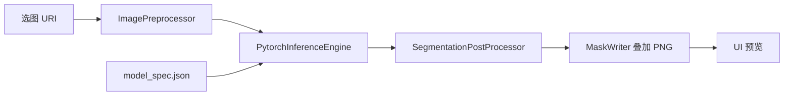

# ToyokawaGroup - SkyEdge 端侧模型部署

[ToyokawaGroup](https://github.com/Hshevin/ToyokawaGroup) 小组项目中的**端侧模型部署**部分：在 Android 设备上离线运行航拍建筑物 / 道路分割模型，完成推理、后处理与结果展示。

| 模块 | 负责人 | 本仓库范围 |
|------|--------|------------|
| 算法训练与导出 |  | 交付 `torchscript.pt`、`model_spec.json`、`best_model.pth` |
| **端侧部署（本部分）** | **端侧** | App 推理链路、模型优化、验收与文档 |
| UI / 本地数据 |  | 不在本 README 详述 |

---

## 功能概览

- **PyTorch Mobile** 加载 TorchScript 模型，512×512 二值分割
- **Building / Road** 双模型，App 内一键切换（无需改 JSON）
- 原图与 **mask 叠加** 并排预览
- 状态栏显示推理耗时、目标区域占比；无目标时提示「未识别到目标区域」
- **连跑 10 次** benchmark（平均 / P90 时延）

---

## 当前模型配置

| 任务 | 加载文件 | 说明 |
|------|----------|------|
| Building | `assets/optimized/building_unet_efficientnetb0_v1_pruned_ft_s2.pt` | 结构化剪枝 + 300 step 微调，**已通过门禁** |
| Road | `assets/models/road_unet_efficientnetb0_v1/road_unet_efficientnetb0_v1_torchscript.pt` | 算法 baseline，剪枝实验未通过，保持原模型 |

配置入口：各模型目录下的 `model_spec.json`（`asset_file` 字段指向实际 `.pt`）。

预处理与后处理约定见 `skyedge_vm_test_images/README.md`（512×512、ImageNet mean/std、sigmoid + threshold）。

---

## 目录结构

```text
android/
├── app/src/main/
│   ├── assets/
│   │   ├── models/                    # 算法交付 + model_spec.json
│   │   └── optimized/                 # 端侧优化产物（building 剪枝版）
│   └── java/com/example/skyedge/
│       ├── MainActivity.kt            # Compose UI、选图、模型切换
│       ├── InferenceViewModel.kt      # 推理状态与 benchmark
│       ├── domain/InspectionResult.kt
│       └── model/                     # 推理引擎与前后处理
│           ├── PytorchInferenceEngine.kt
│           ├── ModelLoader.kt / ModelSpecLoader.kt
│           ├── ImagePreprocessor.kt
│           ├── SegmentationPostProcessor.kt
│           └── MaskWriter.kt
├── docs/
│   ├── MODEL_DELIVERY_CHECKLIST.md    # 算法 → 端侧 交付清单
│   └── MODEL_OPTIMIZATION_DELIVERY_REPORT.md  # 剪枝/量化实验结论
├── tools/                             # 优化与验收脚本（Python）
├── skyedge_vm_test_images/            # VM/本机测试图（不进 APK）
└── README.md                          # 本文件
```

---

## 快速开始

### 环境

- Android Studio（推荐），`minSdk 24`，Kotlin + Jetpack Compose
- 依赖：`org.pytorch:pytorch_android`（见 `app/build.gradle.kts`）

### 运行 App

1. 用 Android Studio 打开本仓库根目录
2. 连接真机或模拟器，Run `app`
3. 点击选图 → 选择 **Building** 或 **Road** → 查看叠加结果
4. 可选：**当前图连跑 10 次** 查看时延统计

> 模型文件较大，首次安装 APK 体积约含 3 个 `.pt`（building 剪枝版 + 两路 baseline 中的 road；building baseline 仍保留在 `models/` 供对照）。

### Python 工具（可选）

```bash
pip install -r tools/requirements-optimize.txt
```

| 脚本 | 用途 |
|------|------|
| `tools/benchmark_torchscript_models.py` | 对比各 `.pt` 体积与 CPU 时延 |
| `tools/structured_prune_unet_smp.py` | 结构化剪枝（channel L1） |
| `tools/prune_finetune_unet_smp.py` | 剪枝 + 快速微调并导出 `.pt` |
| `tools/verify_mask.py` | 端侧 mask 与参考 mask 数值/视觉验收 |

测试数据目录：`skyedge_vm_test_images/`（building/road 各 10 对 image+mask）。

---

## 优化结论（摘要）

完整数据见 [`docs/MODEL_OPTIMIZATION_DELIVERY_REPORT.md`](docs/MODEL_OPTIMIZATION_DELIVERY_REPORT.md)。

| 路线 | Building | Road |
|------|----------|------|
| Baseline TorchScript | 参考基线 | **当前使用** |
| Dynamic INT8 | 无体积/时延收益 | 无收益 |
| 剪枝 S2 + 微调 | **通过门禁，已接入 App** | IoU 塌陷，不接入 |

Building 剪枝版（S2：0.08/0.15/0.25）相对 baseline：体积约 **-32%**，时延约 **-28%**，IoU 掉点 **< 1.5%** 门禁。

---

## 与算法侧对接

- 交付要求：[`docs/MODEL_DELIVERY_CHECKLIST.md`](docs/MODEL_DELIVERY_CHECKLIST.md)
- 每模型需提供：`model_spec.json`、`*_torchscript.pt`、（可选）`best_model.pth` 与 metrics
- 端侧负责：接入 App、剪枝/量化实验、mask 验收、是否替换 baseline 的结论

---

## 推理链路（简要）



1. 按 `model_spec.json` 加载对应 `.pt`
2. Resize + 归一化 → `Tensor`
3. `Module.forward` → logits `(1,1,512,512)`
4. Sigmoid + threshold → 二值 mask → 与原图 alpha 混合

---

## 常见问题

**Road 模型没有 overlay？**  
若画面以农田/绿地为主、无明显道路，模型输出空 mask 属预期。请用 `skyedge_vm_test_images/road/images/` 中的测试图验证；状态栏会显示「未识别到目标区域」。

**如何换模型？**  
修改对应 `model_spec.json` 的 `asset_file`，或通过 App 内 Building/Road 按钮切换（已绑定 spec 路径）。

---

## 许可证与归属

本仓库为 ToyokawaGroup 课程/比赛原型工程。模型权重与测试图来源见各 `metrics.json` 与 `skyedge_vm_test_images/README.md`。
