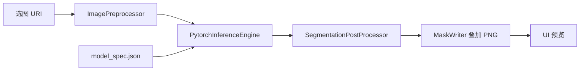

# ToyokawaGroup - SkyEdge 端侧模型部署

[ToyokawaGroup](https://github.com/Hshevin/ToyokawaGroup) 小组项目中的**端侧模型部署**部分：在 Android 设备上离线运行航拍建筑物 / 道路分割模型，完成推理、后处理与结果展示。

| 模块 | 负责人 | 本仓库范围 |
|------|--------|------------|
| 算法训练与导出 | 算法同学 | 交付 `torchscript.pt`、`model_spec.json`、`best_model.pth` |
| **端侧部署（本部分）** | **你** | App 推理链路、模型优化、验收与文档 |
| UI / 本地数据 | 其他同学 | 不在本 README 详述 |

---

## 功能概览

- **PyTorch Mobile** 加载 TorchScript 模型，512×512 二值分割
- **Building / Road** 双模型，App 内一键切换（无需改 JSON）
- 原图与 **mask 叠加** 并排预览
- 状态栏显示推理耗时、目标区域占比；无目标时提示「未识别到目标区域」
- **连跑 10 次** benchmark（平均 / P90 时延）
- **Room 本地库对接**：选图检测写入 `ImageRecordRepository`，mask 与 `summary_json` 落库

---

## 本地数据库对接（ImageRecord）

依赖同学组件：[ToyokawaGroup-DatabaseComponent](https://github.com/Hshevin/ToyokawaGroup-DatabaseComponent)（本仓库 `imgrecord/` 模块）。

| 端侧实现 | 说明 |
|----------|------|
| `SkyEdgeImageAnalyser` | 实现 `ImageAnalyser.analyse(localUrl, imgUrl, analyseType)` |
| `InferenceViewModel.infer(uri)` | `insert` → 后台推理 → 轮询 `done` → UI 展示 |
| mask 路径 | `{local_url}/mask.png`（前缀 `filesDir/analysis/`），`summary_json.mask_path` 同步写入 |

`AnalyseType.BUILDING / ROAD` 对应 building / road 模型；`img_url` 传相册 URI 字符串（`uri.toString()`）。

---

## 当前模型配置

| 任务 | 加载文件 | 说明 |
|------|----------|------|
| Building | `optimized/building_unet_efficientnetb0_v1_pruned_fp8.fp8pkg` | **剪枝 S2 + FP8**，pack **2.38MB**，runtime **~15MB** |
| Road | `optimized/road_unet_efficientnetb0_v1_fp8.fp8pkg` | FP8 量化（road 剪枝未通过，仅量化） |

配置入口：各模型目录下的 `model_spec.json`（`asset_file` 字段指向实际 `.pt`）。

预处理与后处理约定见 `skyedge_vm_test_images/README.md`（512×512、ImageNet mean/std、sigmoid + threshold）。

---

## 目录结构

```text
android/
├── imgrecord/                         # DatabaseComponent（Room + Repository）
├── app/src/main/
│   ├── assets/
│   │   ├── models/                    # 算法交付 + model_spec.json
│   │   └── optimized/                 # 端侧优化产物（building 剪枝版）
│   └── java/com/example/skyedge/
│       ├── MainActivity.kt            # Compose UI、选图、模型切换
│       ├── InferenceViewModel.kt      # insert + 轮询 + 历史记录
│       ├── integration/SkyEdgeImageAnalyser.kt
│       ├── domain/InspectionResult.kt
│       └── model/                     # 推理引擎与前后处理
│           ├── PytorchInferenceEngine.kt
│           ├── ModelLoader.kt / ModelSpecLoader.kt
│           ├── ImagePreprocessor.kt
│           ├── SegmentationPostProcessor.kt
│           └── MaskWriter.kt
├── docs/
│   ├── MODEL_DELIVERY_CHECKLIST.md    # 算法 → 端侧 交付清单
│   └── MODEL_OPTIMIZATION_DELIVERY_REPORT.md  # 剪枝/量化实验结论
├── tools/                             # 优化与验收脚本（Python）
├── skyedge_vm_test_images/            # VM/本机测试图（不进 APK）
└── README.md                          # 本文件
```

---

## 快速开始

### 环境

- Android Studio（推荐），`minSdk 24`，Kotlin + Jetpack Compose
- 依赖：`org.pytorch:pytorch_android`（见 `app/build.gradle.kts`）

### 运行 App

1. 若缺少 `imgrecord/` 目录，先拉取数据库组件：
   ```bash
   git clone https://github.com/Hshevin/ToyokawaGroup-DatabaseComponent.git imgrecord
   ```
2. 用 Android Studio 打开本仓库根目录
3. 连接真机或模拟器，Run `app`
4. 点击选图 → 选择 **Building** 或 **Road** → 查看叠加结果
5. 可选：**当前图连跑 10 次** 查看时延统计

> 模型文件较大，首次安装 APK 体积约含 3 个 `.pt`（building 剪枝版 + 两路 baseline 中的 road；building baseline 仍保留在 `models/` 供对照）。

### Python 工具（可选）

```bash
pip install -r tools/requirements-optimize.txt
```

| 脚本 | 用途 |
|------|------|
| `tools/benchmark_torchscript_models.py` | 对比各 `.pt` 体积与 CPU 时延 |
| `tools/structured_prune_unet_smp.py` | 结构化剪枝（channel L1） |
| `tools/prune_finetune_unet_smp.py` | 剪枝 + 快速微调并导出 `.pt` |
| `tools/quantize_fp8_unet.py` | FP8 量化 + 导出 `.fp8pkg` / runtime `.pt` |
| `tools/tune_fp8_unet.py` | FP8 网格调参（格式/粒度/跳层） |
| `tools/fp8_quant_utils.py` | FP8 打包与反量化工具 |
| `tools/verify_mask.py` | 端侧 mask 与参考 mask 数值/视觉验收 |

FP8 示例（剪枝权重需加 `--prune`）：

```bash
py -3 tools/quantize_fp8_unet.py --prune \
  --checkpoint app/src/main/assets/optimized/building_unet_efficientnetb0_v1_pruned_ft_s2.pth \
  --model-spec app/src/main/assets/models/building_unet_efficientnetb0_v1/model_spec.json \
  --images-dir skyedge_vm_test_images/building/images \
  --masks-dir skyedge_vm_test_images/building/masks \
  --baseline-torchscript app/src/main/assets/optimized/building_unet_efficientnetb0_v1_pruned_fp8_runtime.pt \
  --output-torchscript app/src/main/assets/optimized/building_unet_efficientnetb0_v1_pruned_fp8.pt
```

调参输出到 `tools/out/fp8_tune/`（勿再写入 `assets/optimized/`，避免 APK 膨胀）；选定配置后复制 `best.fp8pkg` / `best_runtime.pt` 到 `assets/optimized/` 并重命名。

---

## 优化结论（摘要）

完整数据见 [`docs/MODEL_OPTIMIZATION_DELIVERY_REPORT.md`](docs/MODEL_OPTIMIZATION_DELIVERY_REPORT.md)。

| 路线 | Building | Road |
|------|----------|------|
| Baseline TorchScript | 参考基线 | **当前使用** |
| Dynamic INT8 | 无体积/时延收益 | 无收益 |
| **FP8 pack（调参后）** | pack **3.79MB**，IoU 掉 0.46% | pack **3.79MB**，IoU 升 0.77% |
| 剪枝 S2 + 微调 | 时延/体积更优，见 optimized 目录 | 未通过 |

Building 剪枝版（S2：0.08/0.15/0.25）相对 baseline：体积约 **-32%**，时延约 **-28%**，IoU 掉点 **< 1.5%** 门禁。

---

## 与算法侧对接

- 交付要求：[`docs/MODEL_DELIVERY_CHECKLIST.md`](docs/MODEL_DELIVERY_CHECKLIST.md)
- 每模型需提供：`model_spec.json`、`*_torchscript.pt`、（可选）`best_model.pth` 与 metrics
- 端侧负责：接入 App、剪枝/量化实验、mask 验收、是否替换 baseline 的结论

---

## 推理链路（简要）



1. 按 `model_spec.json` 加载对应 `.pt`
2. Resize + 归一化 → `Tensor`
3. `Module.forward` → logits `(1,1,512,512)`
4. Sigmoid + threshold → 二值 mask → 与原图 alpha 混合

---

## 常见问题

**Road 模型没有 overlay？**  
若画面以农田/绿地为主、无明显道路，模型输出空 mask 属预期。请用 `skyedge_vm_test_images/road/images/` 中的测试图验证；状态栏会显示「未识别到目标区域」。

**如何换模型？**  
修改对应 `model_spec.json` 的 `asset_file`，或通过 App 内 Building/Road 按钮切换（已绑定 spec 路径）。

---

## 许可证与归属

本仓库为 ToyokawaGroup 课程/比赛原型工程。模型权重与测试图来源见各 `metrics.json` 与 `skyedge_vm_test_images/README.md`。
