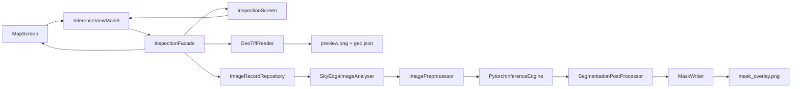

# ToyokawaGroup - SkyEdge 端侧模型部署

[ToyokawaGroup](https://github.com/Hshevin/ToyokawaGroup) 小组项目中的**端侧模型部署**部分：在 Android 设备上离线运行航拍建筑物 / 道路分割模型，完成推理、后处理与结果展示。

| 模块 | 负责人 | 本仓库范围 |
|------|--------|------------|
| 算法训练与导出 |  | 交付 `torchscript.pt`、`model_spec.json`、`best_model.pth` |
| **端侧部署（本部分）** | **端侧** | `skyedge-core` 推理链路、模型优化、验收与文档 |
| **UI** | **前端** | `skyedge-ui` Compose 界面 |
| 本地数据 |  | `imgrecord` Room 组件 |

架构细节见 [`docs/ARCHITECTURE.md`](docs/ARCHITECTURE.md)；接口契约见 [`openapi/api.yaml`](openapi/api.yaml)。

---

## 功能概览

- **PyTorch Mobile** 加载 TorchScript 模型，512×512 二值分割
- **Building / Road** 双模型，App 内一键切换（无需改 JSON）
- 原图与 **mask 叠加** 并排预览
- **高德卫星底图 + GeoTIFF GroundOverlay**，支持端侧读取 WGS84 GeoTIFF 并转换为 GCJ-02 展示
- GeoTIFF 推理后将 Building / Road mask 回映射到 preview 尺寸，并叠加到同一地理范围
- 状态栏显示推理耗时、目标区域占比；无目标时提示「未识别到目标区域」
- **连跑 10 次** benchmark（平均 / P90 时延）
- **Room 本地库对接**：选图检测写入 `ImageRecordRepository`，mask 与 `summary_json` 落库

---

## 本地数据库对接（ImageRecord）

依赖同学组件：[ToyokawaGroup-DatabaseComponent](https://github.com/Hshevin/ToyokawaGroup-DatabaseComponent)（本仓库 `imgrecord/` 模块）。

| 端侧实现 | 说明 |
|----------|------|
| `SkyEdgeImageAnalyser` | 实现 `ImageAnalyser.analyse(localUrl, imgUrl, analyseType)` |
| `InspectionFacade.infer(uri)` | `insert` → 后台推理 → 轮询 `done` → UI 展示 |
| mask 路径 | `{local_url}/mask.png`（前缀 `filesDir/analysis/`），`summary_json.mask_path` 同步写入 |

`AnalyseType.BUILDING / ROAD` 对应 building / road 模型；`img_url` 传相册 URI 字符串（`uri.toString()`）。

---

## 地图与 GeoTIFF

地图页使用高德 Android 地图 SDK 的卫星底图，GeoTIFF 通过 SAF `OpenDocument` 导入并复制到本地分析目录。第一期支持 **未压缩 8-bit RGB/RGBA、EPSG:4326、ModelTiepoint + ModelPixelScale** 的轴对齐 GeoTIFF；暂不支持投影坐标系、16-bit、LZW/Deflate 压缩或带 `ModelTransformation` 旋转矩阵的影像。配置步骤与常见问题见 [`docs/MAP_GEO_SETUP.md`](docs/MAP_GEO_SETUP.md)。

每个地图会话落盘在 `filesDir/analysis/<uuid>/`：

```text
source.tiff
preview.png
geo.json
mask.png
mask_overlay.png
```

`geo.json` 与 `summary_json.geo` 记录 WGS84 原始范围和 GCJ-02 展示范围；mask 从模型输出尺寸回映射到 `preview.png` 尺寸后作为 `GroundOverlay` 叠加。

---

## 当前模型配置

| 任务 | 加载文件 | 说明 |
|------|----------|------|
| Building | `optimized/building_unet_efficientnetb0_v1_pruned_fp8.fp8pkg` | **剪枝 S2 + FP8**，pack **2.38MB**，runtime **~15MB** |
| Road | `optimized/road_unet_efficientnetb0_v1_fp8.fp8pkg` | FP8 量化（road 剪枝未通过，仅量化） |

配置入口：各模型目录下的 `model_spec.json`（`asset_file` 字段指向实际 `.pt`）。资产位于 `skyedge-core/src/main/assets/`。

预处理与后处理约定见 `skyedge_vm_test_images/README.md`（512×512、ImageNet mean/std、sigmoid + threshold）。

---

## 目录结构

```text
├── app/                               # 应用壳：MainActivity、Manifest
├── skyedge-ui/                        # 前端：Compose UI + 薄 ViewModel
│   └── src/main/java/.../ui/inspection/
│       ├── InspectionScreen.kt
│       ├── InferenceViewModel.kt
│       └── MaskOverlay.kt
│   └── src/main/java/.../ui/map/
│       ├── AMapCompose.kt
│       ├── MapScreen.kt
│       └── MapOverlayManager.kt
├── skyedge-core/                      # 端侧核心：推理 + 编排 Facade
│   ├── src/main/assets/               # models/、optimized/、*.pt
│   └── src/main/java/.../core/
│       ├── api/InspectionFacade.kt    # UI 契约
│       ├── geo/                       # GeoTIFF、WGS84/GCJ-02、geo.json
│       ├── impl/InspectionFacadeImpl.kt
│       ├── integration/SkyEdgeImageAnalyser.kt
│       ├── domain/InspectionResult.kt
│       └── model/                     # PytorchInferenceEngine 等
├── imgrecord/                         # DatabaseComponent（Room + Repository）
├── openapi/api.yaml                   # JSON / Facade 字段契约
├── docs/
│   ├── ARCHITECTURE.md                # 模块与依赖说明
│   ├── MODEL_DELIVERY_CHECKLIST.md
│   └── MODEL_OPTIMIZATION_DELIVERY_REPORT.md
├── tools/                             # 优化与验收脚本（Python）
├── skyedge_vm_test_images/
└── README.md
```

---

## 协同开发

| 模块 | 典型工作 | 单测 / 预览 |
|------|----------|-------------|
| `skyedge-ui` | 界面、交互、主题 | `FakeInspectionFacade` 无需 PyTorch |
| `skyedge-core` | 推理、Facade、模型接入 | `skyedge-core/src/test` |
| `imgrecord` | Room、Repository | `imgrecord/src/test` |
| `app` | 集成、权限、打包 | `assembleDebug` |

依赖方向：`app` → `skyedge-ui` → `skyedge-core` → `imgrecord`（禁止反向）。

---

## 快速开始

### 环境

- Android Studio（推荐），`minSdk 24`，Kotlin + Jetpack Compose
- PyTorch Mobile 依赖见 `skyedge-core/build.gradle.kts`

### 运行 App

1. 若缺少 `imgrecord/` 目录，先拉取数据库组件：
   ```bash
   git clone https://github.com/Hshevin/ToyokawaGroup-DatabaseComponent.git imgrecord
   ```
2. 用 Android Studio 打开本仓库根目录
3. 复制 `local.properties.example` 为 `local.properties`，填入本机 `sdk.dir` 与 `AMAP_API_KEY`
4. 连接真机（推荐，地图/OpenGL 更稳定）或模拟器，Run `app`
5. 地图页：点击 **导入 GeoTIFF** → 选择 Building/Road → **开始检测** → 查看卫星底图、正射图与 mask 叠加
6. 检测页：点击选图 → 选择 **Building** 或 **Road** → 查看普通图片叠加结果
7. 可选：**当前图连跑 10 次** 查看时延统计

> 当前 App 使用 FP8 打包模型（building 剪枝 + FP8 / road FP8）。高德瓦片需要网络；推理与存储均在端侧完成。

### 构建与测试

```bash
./gradlew :skyedge-core:test :app:assembleDebug
```

### Python 工具（可选）

```bash
pip install -r tools/requirements-optimize.txt
```

| 脚本 | 用途 |
|------|------|
| `tools/benchmark_torchscript_models.py` | 对比各 `.pt` 体积与 CPU 时延 |
| `tools/structured_prune_unet_smp.py` | 结构化剪枝（channel L1） |
| `tools/prune_finetune_unet_smp.py` | 剪枝 + 快速微调并导出 `.pt` |
| `tools/quantize_fp8_unet.py` | FP8 量化 + 导出 `.fp8pkg` / runtime `.pt` |
| `tools/tune_fp8_unet.py` | FP8 网格调参（格式/粒度/跳层） |
| `tools/fp8_quant_utils.py` | FP8 打包与反量化工具 |
| `tools/verify_mask.py` | 端侧 mask 与参考 mask 数值/视觉验收 |

FP8 示例（剪枝权重需加 `--prune`）：

```bash
py -3 tools/quantize_fp8_unet.py --prune \
  --checkpoint app/src/main/assets/optimized/building_unet_efficientnetb0_v1_pruned_ft_s2.pth \
  --model-spec app/src/main/assets/models/building_unet_efficientnetb0_v1/model_spec.json \
  --images-dir skyedge_vm_test_images/building/images \
  --masks-dir skyedge_vm_test_images/building/masks \
  --baseline-torchscript app/src/main/assets/optimized/building_unet_efficientnetb0_v1_pruned_fp8_runtime.pt \
  --output-torchscript app/src/main/assets/optimized/building_unet_efficientnetb0_v1_pruned_fp8.pt
```

调参输出到 `tools/out/fp8_tune/`（勿再写入 `assets/optimized/`，避免 APK 膨胀）；选定配置后复制 `best.fp8pkg` / `best_runtime.pt` 到 `assets/optimized/` 并重命名。

---

## 优化结论（摘要）

完整数据见 [`docs/MODEL_OPTIMIZATION_DELIVERY_REPORT.md`](docs/MODEL_OPTIMIZATION_DELIVERY_REPORT.md)。

| 路线 | Building | Road |
|------|----------|------|
| Baseline TorchScript | 参考基线 | **当前使用** |
| Dynamic INT8 | 无体积/时延收益 | 无收益 |
| **FP8 pack（调参后）** | pack **3.79MB**，IoU 掉 0.46% | pack **3.79MB**，IoU 升 0.77% |
| 剪枝 S2 + 微调 | 时延/体积更优，见 optimized 目录 | 未通过 |

Building 剪枝版（S2：0.08/0.15/0.25）相对 baseline：体积约 **-32%**，时延约 **-28%**，IoU 掉点 **< 1.5%** 门禁。

---

## 与算法侧对接

- 交付要求：[`docs/MODEL_DELIVERY_CHECKLIST.md`](docs/MODEL_DELIVERY_CHECKLIST.md)
- 每模型需提供：`model_spec.json`、`*_torchscript.pt`、（可选）`best_model.pth` 与 metrics
- 端侧负责：接入 `skyedge-core`、剪枝/量化实验、mask 验收、是否替换 baseline 的结论

---

## 推理链路（简要）



1. 按 `model_spec.json` 加载对应 `.pt`
2. Resize + 归一化 → `Tensor`
3. `Module.forward` → logits `(1,1,512,512)`
4. Sigmoid + threshold → 二值 mask → 与原图 alpha 混合

---

## 常见问题

**Road 模型没有 overlay？**  
若画面以农田/绿地为主、无明显道路，模型输出空 mask 属预期。请用 `skyedge_vm_test_images/road/images/` 中的测试图验证；状态栏会显示「未识别到目标区域」。

**如何换模型？**  
修改 `skyedge-core/src/main/assets/` 下对应 `model_spec.json` 的 `asset_file`，或通过 App 内 Building/Road 按钮切换（已绑定 spec 路径）。

---

## 许可证与归属

本仓库为 ToyokawaGroup 课程/比赛原型工程。模型权重与测试图来源见各 `metrics.json` 与 `skyedge_vm_test_images/README.md`。
