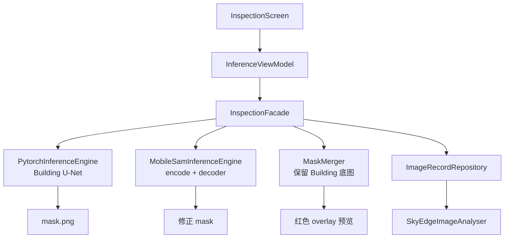

# ToyokawaGroup - SkyEdge 端侧模型部署

[ToyokawaGroup](https://github.com/Hshevin/ToyokawaGroup) 小组项目中的**端侧模型部署**部分：在 Android 设备上离线运行航拍 **Building 分割**与 **MobileSAM 交互修正**，完成推理、后处理与结果展示。

| 模块 | 本仓库范围 |
|------|------------|
| 算法训练与导出 | 交付 `torchscript.pt`、`model_spec.json`、`best_model.pth` |
| **端侧部署** | `skyedge-core` 推理链路、模型优化、MobileSAM 接入、验收与文档 |
| **UI** | `skyedge-ui` Compose 界面（四 Tab + 地图核查） |
| 本地数据 | `imgrecord` Room 组件 |

架构细节见 [`docs/ARCHITECTURE.md`](docs/ARCHITECTURE.md)；功能规划见 [`docs/TODO.md`](docs/TODO.md)；接口契约见 [`openapi/api.yaml`](openapi/api.yaml)。

---

## 功能概览

### 检测页（Inspection）

- **Building 自动分割**：导入现场照片后，PyTorch Mobile 加载 FP8 U-Net，输出 512×512 二值 mask
- **MobileSAM 局部修正**（后台引擎，无需切换模型）：
  - Building 检测完成后自动预热 SAM encoder
  - **单击**：在点击位置用 MobileSAM 补漏 / 修正 mask
  - **框选**：选中框内全部 Building 已检测区域；若框内几乎无检测结果，则回退为 SAM 点选
- 原图与 **红色半透明 mask** 并排预览，左右两图均支持点选 / 框选
- 状态栏显示推理耗时、目标区域占比；无目标时提示「未识别到目标区域」
- **Building 修正演示**：内置 demo 图，无需选图即可体验 MobileSAM
- **连跑 10 次** benchmark（平均 / P90 时延）
- **Room 本地库**：选图检测写入 `ImageRecordRepository`，mask 与 `summary_json` 落盘
- **任务/核查闭环**：本地 `Task`、`Anomaly` 表，推理后自动生成建筑候选卡片与缩略图，支持人工确认/排除、严重程度标注与手动 bbox 框选
- **四 Tab 端侧 UI**：任务、影像、核查、报告；相册/GeoTIFF/内置样例图入口、核查卡片、拍照取证、报告预览与导出
- **地图核查交互**：GeoTIFF 模式下可点击 mask 命中建筑对象，并在底部卡片中快速确认或排除
- **离线报告**：端侧导出长图、JSON、CSV、PDF、GeoJSON 文件，报告页展示建筑明细、附件缩略图与长图预览，不依赖远程服务
- **灾害与深化入口**：GPS 轨迹采集/闭合、双时相卷帘状态、MobileSAM 点选入口

### 地图页（Map）

- **高德卫星底图 + GeoTIFF GroundOverlay**
- 端侧读取 WGS84 GeoTIFF（支持 **无压缩 / LZW / Deflate** 8-bit RGB/RGBA），转换为 GCJ-02 展示
- GeoTIFF 推理后将 Building mask 回映射到 preview 尺寸，叠加到同一地理范围
- 图层开关：正射图 / mask 显隐、mask 透明度调节

---

## 交互流程（检测页）

```text
导入照片
    ↓
Building U-Net 自动分割 → 右侧红色 mask overlay
    ↓
后台 MobileSAM encode（按 Building mask 裁剪 ROI，可选）
    ↓
顶部横幅「✓ 可交互」后：
  · 单击 → MobileSAM 在该点修正 mask
  · 拖拽框选 → 选中框内 Building 检测区域（SAM 补漏）
```

| 视觉元素 | 含义 |
|----------|------|
| 半透明红色区域 | 分割 mask（Building + 修正结果） |
| 白点（黑边） | MobileSAM 提示位置（操作标记，非 mask 本身） |
| 蓝色矩形（拖拽时） | 框选预览 |

---

## 本地数据库对接（ImageRecord）

依赖：[ToyokawaGroup-DatabaseComponent](https://github.com/Hshevin/ToyokawaGroup-DatabaseComponent)（本仓库 `imgrecord/` 模块）。

| 端侧实现 | 说明 |
|----------|------|
| `SkyEdgeImageAnalyser` | 实现 `ImageAnalyser.analyse(localUrl, imgUrl, analyseType)` |
| `InspectionFacade.infer(uri)` | `insert` → Building 推理 → MobileSAM 预热 → UI 展示 |
| mask 路径 | `{local_url}/mask.png`；MobileSAM 会话 `filesDir/analysis/mobile_sam_session/mask.png` |

当前仅 `AnalyseType.BUILDING`；Road 模型已从 App 移除。

---

## 地图与 GeoTIFF

地图页使用高德 Android 地图 SDK。GeoTIFF 通过 SAF `OpenDocument` 导入。支持 **EPSG:4326**、轴对齐 GeoTIFF（ModelTiepoint + ModelPixelScale）；暂不支持投影坐标系、16-bit 或带旋转矩阵的 `ModelTransformation`。

配置步骤见 [`docs/MAP_GEO_SETUP.md`](docs/MAP_GEO_SETUP.md)。

每个地图会话落盘在 `filesDir/analysis/<uuid>/`：

```text
source.tiff
preview.png
geo.json
mask.png
mask_overlay.png
```

---

## 当前模型配置

| 任务 | 资产路径 | 说明 |
|------|----------|------|
| **Building**（主检测） | `optimized/building_unet_efficientnetb0_v1_pruned_fp8.fp8pkg` | 剪枝 S2 + FP8，pack ~2.4MB |
| **MobileSAM**（交互修正） | `models/mobile_sam_interactive_v1/mobile_sam_encoder_fp8.fp8pkg` + `mobile_sam_decoder_fp8.fp8pkg` | encoder ~48MB + decoder ~43MB runtime；后台加载，decoder 懒加载 |

配置入口：各目录下 `model_spec.json`（`asset_file` / `decoder_asset` 字段）。资产位于 `skyedge-core/src/main/assets/`。

MobileSAM 交付包与 demo 见 `skyedge_mobilesam_delivery/`；导出 / FP8 脚本见 `tools/export_mobile_sam_torchscript.py`、`tools/quantize_fp8_mobile_sam.py`。

预处理约定见 `skyedge_vm_test_images/README.md`（512×512、ImageNet mean/std、sigmoid + threshold）。

---

## 目录结构

```text
├── app/                               # 应用壳：MainActivity、Manifest
├── skyedge-ui/                        # Compose UI + 薄 ViewModel
│   └── ui/inspection/                 # 检测页、手势映射、mask overlay
│   └── ui/map/                        # 地图页、高德、GeoTIFF overlay
├── skyedge-core/                      # 推理 + Facade + 模型 assets
│   ├── assets/models/building_unet_*  # Building spec + torchscript
│   ├── assets/models/mobile_sam_*     # MobileSAM FP8 encoder/decoder + demo
│   ├── assets/optimized/              # FP8 打包模型
│   └── core/model/                    # PytorchInferenceEngine、MobileSamInferenceEngine 等
├── imgrecord/                         # Room + ImageRecordRepository
├── skyedge_mobilesam_delivery/        # MobileSAM 算法交付与 demo
├── openapi/api.yaml                   # Facade / JSON 契约
├── docs/                              # 架构、交付清单、优化报告
├── tools/                             # 剪枝 / FP8 / MobileSAM 导出脚本
├── geotiff_map_test_samples/          # 地图测试样例（不进 APK）
└── skyedge_vm_test_images/            # Building 验收图（road 已移除）
```

---

## 协同开发

| 模块 | 典型工作 | 单测 / 预览 |
|------|----------|-------------|
| `skyedge-ui` | 界面、点选/框选手势、主题 | `FakeInspectionFacade` 无需 PyTorch |
| `skyedge-core` | Building + MobileSAM 推理、Facade | `skyedge-core/src/test` |
| `imgrecord` | Room、Repository | `imgrecord/src/test` |
| `app` | 集成、权限、打包 | `assembleDebug` |

依赖方向：`app` → `skyedge-ui` → `skyedge-core` → `imgrecord`（禁止反向）。

---

## 快速开始

### 环境

- Android Studio（推荐），`minSdk 24`，Kotlin + Jetpack Compose
- PyTorch Mobile 依赖见 `skyedge-core/build.gradle.kts`
- 真机推荐（模型较大，模拟器首次加载较慢）

### 运行 App

1. 若缺少 `imgrecord/`，拉取数据库组件：
   ```bash
   git clone https://github.com/Hshevin/ToyokawaGroup-DatabaseComponent.git imgrecord
   ```
2. Android Studio 打开本仓库根目录
3. 复制 `local.properties.example` 为 `local.properties`，填入 `sdk.dir` 与 `AMAP_API_KEY`（地图页需要）
4. 连接真机（推荐，地图/OpenGL 更稳定）或模拟器，Run `app`
5. 影像页：可选择 **相册/无人机截图**、**导入 GeoTIFF** 或 **内置样例图**，再开始 Building 检测
6. GeoTIFF 模式：点击 **开始检测** → 查看卫星底图、正射图与 mask 叠加 → 点击建筑 mask 打开底部标注卡片
7. 核查页：在原图/mask 画布上点选候选或拖拽新增 bbox，填写类型、严重程度、备注并拍照取证
8. 报告页：生成长图、JSON、CSV、PDF、GeoJSON，并通过系统分享导出
9. 可选：**当前图连跑 10 次** 查看时延统计

**检测页**

1. 等待 Building 模型加载完成（首次启动会解压模型到内部存储，约需数十秒）
2. **导入现场照片** → 自动 Building 分割 → 等待顶部 **「✓ 可交互」**
3. 在原图或对比图上 **单击** 修正，或 **拖拽框选** 选中区域内建筑
4. 可选：**Building 修正演示**（内置 demo，无需选图）

**地图页**

1. **导入 GeoTIFF** → **开始检测** → 查看卫星底图与 mask 叠加  
   测试样例：`geotiff_map_test_samples/rgb_geotiff/`

> 高德瓦片需要网络；Building / MobileSAM 推理均在端侧完成。

### 构建与测试

```bash
./gradlew :skyedge-core:test :app:assembleDebug
```

### Python 工具（可选）

```bash
pip install -r tools/requirements-optimize.txt
pip install -r tools/requirements-export.txt   # MobileSAM 导出
```

| 脚本 | 用途 |
|------|------|
| `tools/benchmark_torchscript_models.py` | 对比各 `.pt` 体积与 CPU 时延 |
| `tools/quantize_fp8_unet.py` | Building U-Net FP8 量化 |
| `tools/export_mobile_sam_torchscript.py` | MobileSAM encoder/decoder TorchScript 导出 |
| `tools/quantize_fp8_mobile_sam.py` | MobileSAM FP8 量化与验收 |
| `tools/verify_mask.py` | mask 数值 / 视觉验收 |

---

## 推理链路（简要）



1. Building：`model_spec.json` → FP8 runtime `.pt` → 512×512 logits → 二值 mask
2. MobileSAM：encoder 对整图 / ROI encode → 用户点 / 框触发 decoder → 与 Building mask 合并
3. UI：`MaskOverlayRenderer` 渲染红色半透明 overlay

---

## 优化结论（摘要）

完整数据见 [`docs/MODEL_OPTIMIZATION_DELIVERY_REPORT.md`](docs/MODEL_OPTIMIZATION_DELIVERY_REPORT.md)。

| 模型 | 当前方案 | 要点 |
|------|----------|------|
| Building | 剪枝 S2 + FP8 | pack ~2.4MB，相对 baseline 体积约 -32%，IoU 掉点 < 1.5% |
| MobileSAM | FP8 weight-only | encoder + decoder 各 ~40–48MB runtime，端侧可交互修正 |

---

## 与算法侧对接

- 交付要求：[`docs/MODEL_DELIVERY_CHECKLIST.md`](docs/MODEL_DELIVERY_CHECKLIST.md)
- Building：U-Net TorchScript + `model_spec.json` + metrics
- MobileSAM：`skyedge_mobilesam_delivery/`（encoder/decoder FP8、demo 点坐标、验收指标）

---

## 常见问题

**框选很大，红色区域很小？**  
框选会选中框内 **Building 已检测到的区域**。若 Building 未覆盖框内建筑，请 **单击** 具体目标，用 MobileSAM 补漏。确保先等到 **「✓ 可交互」** 再操作。

**白点是什么？**  
MobileSAM 的提示位置标记，不是 mask。红色半透明区域才是分割结果。

**首次启动很慢？**  
首次需将 FP8 模型从 APK 解压到内部存储（Building + MobileSAM 合计约 100MB+）。第二次启动会快很多。

**如何换 Building 模型？**  
修改 `skyedge-core/src/main/assets/models/building_unet_efficientnetb0_v1/model_spec.json` 的 `asset_file`，或替换 `assets/optimized/` 下对应 `.fp8pkg` / runtime `.pt`。

---

## 许可证与归属

本仓库为 ToyokawaGroup 课程/比赛原型工程。模型权重与测试图来源见各 `metrics.json` 与 `skyedge_vm_test_images/README.md`。
