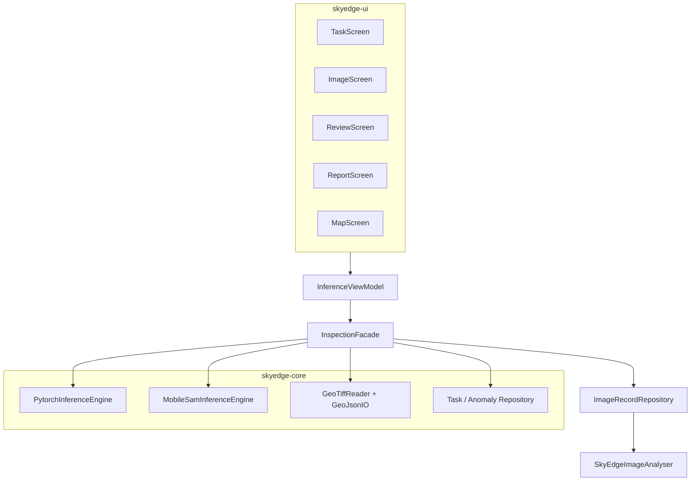

# ToyokawaGroup — SkyEdge 端侧建筑核查 App

[ToyokawaGroup](https://github.com/Hshevin/ToyokawaGroup) 小组项目中的 **SkyEdge 端侧巡检原型**：在 Android 设备上离线完成 **建筑分割检测 → 人工核查 → 报告导出**，并支持 **GeoTIFF 地图核查** 与 **MobileSAM 交互修正**。

> 本仓库已从早期的「端侧模型部署」子项目，扩展为 **任务 / 影像 / 核查 / 报告** 四 Tab 闭环 MVP；模型优化与推理仍是核心能力之一，但不再是唯一定位。

| 模块 | 本仓库范围 |
|------|------------|
| 算法训练与导出 | 交付 `torchscript.pt`、`model_spec.json`、`best_model.pth` |
| **端侧推理** | `skyedge-core`：Building U-Net、MobileSAM、GeoTIFF 解码、mask 后处理 |
| **业务编排** | 本地任务 / 异常卡片 / 人工复核 / 离线报告（JSON、CSV、PDF、GeoJSON、长图） |
| **UI** | `skyedge-ui` Compose 四 Tab + 地图核查 + 建筑标注页 |
| 本地数据 | `imgrecord` Room 组件 + Task / Anomaly 表 |

架构细节见 [`docs/ARCHITECTURE.md`](docs/ARCHITECTURE.md)；功能规划见 [`docs/TODO.md`](docs/TODO.md)；接口契约见 [`openapi/api.yaml`](openapi/api.yaml)。

---

## 产品能力一览

### 任务（Task）

- 本地创建 **建筑核查** / **灾害范围核查** 任务
- 任务状态流转：检测中 → 人工复核 → 可导出
- 统计影像数、候选建筑数

### 影像（Image / Inspection）

- **Building 自动分割**：导入现场照片后，PyTorch Mobile 加载 FP8 U-Net，输出 512×512 二值 mask
- **MobileSAM 局部修正**（后台引擎，无需切换模型）：
  - Building 检测完成后自动预热 SAM encoder
  - **单击**：在点击位置用 MobileSAM 补漏 / 修正 mask
  - **框选**：选中框内全部 Building 已检测区域；若框内几乎无检测结果，则回退为 SAM 点选
- 原图与 **红色半透明 mask** 并排预览，左右两图均支持点选 / 框选
- 相册 / 无人机截图、**内置样例图**、**GeoTIFF 正射图** 多种导入方式
- **Room 本地库**：选图检测写入 `ImageRecordRepository`，mask 与 `summary_json` 落盘
- 推理后自动生成建筑候选卡片与缩略图

### 核查（Review）

- **建筑标注页**：对齐设计稿的 bbox + mask 画布、候选横向列表、分页指示
- 人工确认 / 排除 / 标注类型（新建、疑似违建、临时结构等）
- **GeoTIFF 模式自动回填经纬度**（WGS84 / GCJ-02）；普通照片显示画面区域百分比
- 拖拽框选新增候选、拍照取证、保存校正

### 报告（Report）

- 端侧导出 **长图、JSON、CSV、PDF、GeoJSON**，不依赖远程服务
- 报告页展示建筑明细、附件缩略图与长图预览
- 系统分享导出

### 地图（Map）

- **高德卫星底图 + GeoTIFF GroundOverlay**
- 端侧读取 WGS84 GeoTIFF（支持 **无压缩 / LZW / Deflate** 8-bit RGB/RGBA），转换为 GCJ-02 展示
- GeoTIFF 推理后将 Building mask 回映射到 preview 尺寸，叠加到同一地理范围
- 图层开关：正射图 / mask 显隐、mask 透明度调节
- 点击 mask 命中建筑，联动核查卡片

### 灾害与深化入口

- GPS 轨迹采集 / 闭合
- 双时相卷帘状态
- MobileSAM 点选演示入口

---

## 交互流程（检测页）

```text
导入照片 / GeoTIFF / 样例图
    ↓
Building U-Net 自动分割 → 红色 mask overlay
    ↓
后台 MobileSAM encode（按 Building mask 裁剪 ROI，可选）
    ↓
顶部横幅「✓ 可交互」后：
  · 单击 → MobileSAM 在该点修正 mask
  · 拖拽框选 → 选中框内 Building 检测区域（SAM 补漏）
    ↓
核查 Tab：确认 / 排除 / 标注 / 拍照
    ↓
报告 Tab：导出 JSON / CSV / PDF / GeoJSON / 长图
```

| 视觉元素 | 含义 |
|----------|------|
| 半透明红色区域 | 分割 mask（Building + 修正结果） |
| 白点（黑边） | MobileSAM 提示位置（操作标记，非 mask 本身） |
| 蓝色矩形（拖拽时） | 框选预览 |
| 黄色 bbox | 核查页建筑候选框 |

---

## 本地数据库

依赖：[ToyokawaGroup-DatabaseComponent](https://github.com/Hshevin/ToyokawaGroup-DatabaseComponent)（本仓库 `imgrecord/` 模块）。

| 表 / 组件 | 说明 |
|-----------|------|
| `task` | 本地巡检任务（场景类型、状态、优先级） |
| `image_record` | 影像推理记录，关联 task |
| `anomaly` | 建筑候选卡片：bbox、人工标签、复核状态、缩略图、取证照片 |
| `SkyEdgeImageAnalyser` | 实现 `ImageAnalyser.analyse(localUrl, imgUrl, analyseType)` |
| `InspectionFacade` | 统一编排推理、任务、核查、报告、地图会话 |

mask 路径：`{local_url}/mask.png`；MobileSAM 会话 `filesDir/analysis/mobile_sam_session/mask.png`。

当前主检测任务为 `AnalyseType.BUILDING`；Road 模型已从 App 移除。

---

## 地图与 GeoTIFF

地图页使用高德 Android 地图 SDK。GeoTIFF 通过 SAF `OpenDocument` 导入。支持 **EPSG:4326**、轴对齐 GeoTIFF（ModelTiepoint + ModelPixelScale）；暂不支持投影坐标系、16-bit 或带旋转矩阵的 `ModelTransformation`。

配置步骤见 [`docs/MAP_GEO_SETUP.md`](docs/MAP_GEO_SETUP.md)。

每个地图会话落盘在 `filesDir/analysis/<uuid>/`：

```text
source.tiff
preview.png
geo.json          # 含 WGS84 bounds、geo_affine、preview 尺寸
mask.png
mask_overlay.png
```

核查页经纬度解析链：**mask bbox 中心 → preview 像素 → source 像素 → WGS84 → GCJ-02 标签**（境外坐标保留 WGS84）。

---

## 当前模型配置

| 任务 | 资产路径 | 说明 |
|------|----------|------|
| **Building**（主检测） | `optimized/building_unet_efficientnetb0_v1_pruned_fp8.fp8pkg` | 剪枝 S2 + FP8，pack ~2.4MB |
| **MobileSAM**（交互修正） | `models/mobile_sam_interactive_v1/mobile_sam_encoder_fp8.fp8pkg` + `mobile_sam_decoder_fp8.fp8pkg` | encoder ~48MB + decoder ~43MB runtime；后台加载，decoder 懒加载 |

配置入口：各目录下 `model_spec.json`（`asset_file` / `decoder_asset` 字段）。资产位于 `skyedge-core/src/main/assets/`。

MobileSAM 交付包与 demo 见 `skyedge_mobilesam_delivery/`；导出 / FP8 脚本见 `tools/export_mobile_sam_torchscript.py`、`tools/quantize_fp8_mobile_sam.py`。

预处理约定见 `skyedge_vm_test_images/README.md`（512×512、ImageNet mean/std、sigmoid + threshold）。

---

## 目录结构

```text
├── app/                               # 应用壳：MainActivity、Manifest
├── skyedge-ui/                        # Compose UI + 薄 ViewModel
│   └── ui/task/                       # 任务列表
│   └── ui/image/                      # 影像入口（相册 / GeoTIFF / 样例）
│   └── ui/inspection/                 # 检测页、手势映射、mask overlay
│   └── ui/review/                     # 建筑标注 / 人工核查
│   └── ui/report/                     # 报告预览与导出
│   └── ui/map/                        # 地图页、高德、GeoTIFF overlay
├── skyedge-core/                      # 推理 + Facade + 模型 assets
│   ├── assets/models/building_unet_*  # Building spec + torchscript
│   ├── assets/models/mobile_sam_*     # MobileSAM FP8 encoder/decoder + demo
│   ├── assets/optimized/              # FP8 打包模型
│   ├── core/geo/                      # GeoTIFF 解码、LZW、坐标转换
│   └── core/model/                    # PytorchInferenceEngine、MobileSamInferenceEngine 等
├── imgrecord/                         # Room + ImageRecordRepository
├── skyedge_mobilesam_delivery/        # MobileSAM 算法交付与 demo
├── openapi/api.yaml                   # Facade / JSON 契约
├── docs/                              # 架构、交付清单、优化报告、MVP 测试报告
├── tools/                             # 剪枝 / FP8 / MobileSAM 导出脚本
├── geotiff_map_test_samples/          # 地图测试样例（不进 APK）
└── skyedge_vm_test_images/            # Building 验收图
```

---

## 协同开发

| 模块 | 典型工作 | 单测 / 预览 |
|------|----------|-------------|
| `skyedge-ui` | 界面、点选/框选手势、四 Tab 流程 | `FakeInspectionFacade` 无需 PyTorch |
| `skyedge-core` | Building + MobileSAM 推理、Facade、GeoTIFF | `skyedge-core/src/test` |
| `imgrecord` | Room、Repository | `imgrecord/src/test` |
| `app` | 集成、权限、打包 | `assembleDebug` |

依赖方向：`app` → `skyedge-ui` → `skyedge-core` → `imgrecord`（禁止反向）。

---

## 快速开始

### 环境

- Android Studio（推荐），`minSdk 24`，Kotlin + Jetpack Compose
- PyTorch Mobile 依赖见 `skyedge-core/build.gradle.kts`
- 真机推荐（模型较大，模拟器首次加载较慢）

### 运行 App

1. 若缺少 `imgrecord/`，拉取数据库组件：
   ```bash
   git clone https://github.com/Hshevin/ToyokawaGroup-DatabaseComponent.git imgrecord
   ```
2. Android Studio 打开本仓库根目录
3. 复制 `local.properties.example` 为 `local.properties`，填入 `sdk.dir` 与 `AMAP_API_KEY`（地图页需要）
4. 连接真机（推荐）或模拟器，Run `app`
5. **任务 Tab**：创建或选择建筑核查任务
6. **影像 Tab**：相册 / GeoTIFF / 内置样例 → **开始检测**
7. **地图模式**：导入 GeoTIFF → 开始检测 → 卫星底图 + 正射 + mask 叠加
8. **核查 Tab**：点选候选建筑，确认经纬度 / 类型 / 备注，拍照取证
9. **报告 Tab**：预览并导出 JSON / CSV / PDF / GeoJSON / 长图

**检测页交互**

1. 等待 Building 模型加载完成（首次启动会解压模型到内部存储，约需数十秒）
2. **导入现场照片** → 自动 Building 分割 → 等待顶部 **「✓ 可交互」**
3. 在原图或对比图上 **单击** 修正，或 **拖拽框选** 选中区域内建筑
4. 可选：**Building 修正演示**（内置 demo，无需选图）

> 高德瓦片需要网络；Building / MobileSAM 推理与报告导出均在端侧完成。

### 构建与测试

```bash
./gradlew :skyedge-core:test :app:assembleDebug
```

GeoTIFF / LZW 相关单测：

```bash
./gradlew :skyedge-core:testDebugUnitTest --tests "com.example.skyedge.core.geo.*"
```

### Python 工具（可选）

```bash
pip install -r tools/requirements-optimize.txt
pip install -r tools/requirements-export.txt   # MobileSAM 导出
```

| 脚本 | 用途 |
|------|------|
| `tools/benchmark_torchscript_models.py` | 对比各 `.pt` 体积与 CPU 时延 |
| `tools/quantize_fp8_unet.py` | Building U-Net FP8 量化 |
| `tools/export_mobile_sam_torchscript.py` | MobileSAM encoder/decoder TorchScript 导出 |
| `tools/quantize_fp8_mobile_sam.py` | MobileSAM FP8 量化与验收 |
| `tools/verify_mask.py` | mask 数值 / 视觉验收 |

---

## 系统架构（简要）



1. **Building**：`model_spec.json` → FP8 runtime `.pt` → 512×512 logits → 二值 mask
2. **MobileSAM**：encoder 对整图 / ROI encode → 用户点 / 框触发 decoder → 与 Building mask 合并
3. **GeoTIFF**：端侧 LZW/Deflate 解码 → preview + geo.json → 地图 overlay + 核查经纬度
4. **核查闭环**：mask 连通域 → 候选 anomaly → 人工复核 → 报告导出

---

## 优化结论（摘要）

完整数据见 [`docs/MODEL_OPTIMIZATION_DELIVERY_REPORT.md`](docs/MODEL_OPTIMIZATION_DELIVERY_REPORT.md)。

| 模型 | 当前方案 | 要点 |
|------|----------|------|
| Building | 剪枝 S2 + FP8 | pack ~2.4MB，相对 baseline 体积约 -32%，IoU 掉点 < 1.5% |
| MobileSAM | FP8 weight-only | encoder + decoder 各 ~40–48MB runtime，端侧可交互修正 |

---

## 与算法侧对接

- 交付要求：[`docs/MODEL_DELIVERY_CHECKLIST.md`](docs/MODEL_DELIVERY_CHECKLIST.md)
- Building：U-Net TorchScript + `model_spec.json` + metrics
- MobileSAM：`skyedge_mobilesam_delivery/`（encoder/decoder FP8、demo 点坐标、验收指标）

---

## 常见问题

**框选很大，红色区域很小？**  
框选会选中框内 **Building 已检测到的区域**。若 Building 未覆盖框内建筑，请 **单击** 具体目标，用 MobileSAM 补漏。确保先等到 **「✓ 可交互」** 再操作。

**核查页显示「画面区域 xx%」而不是经纬度？**  
只有 **GeoTIFF 导入并检测** 的批次会自动回填坐标。普通照片 / 内置样例无地理信息，仅显示画面百分比。进入核查 Tab 后会尝试对已有 GeoTIFF 记录批量回填。

**WGS84 和 GCJ-02 有什么区别？**  
WGS84 是 GPS 国际标准坐标；GCJ-02 是国内地图（高德等）使用的加密坐标。App 对国内区域显示 GCJ-02，境外 GeoTIFF（如 SpaceNet 样例）显示 WGS84。

**首次启动很慢？**  
首次需将 FP8 模型从 APK 解压到内部存储（Building + MobileSAM 合计约 100MB+）。第二次启动会快很多。

**如何换 Building 模型？**  
修改 `skyedge-core/src/main/assets/models/building_unet_efficientnetb0_v1/model_spec.json` 的 `asset_file`，或替换 `assets/optimized/` 下对应 `.fp8pkg` / runtime `.pt`。

---

## 许可证与归属

本仓库为 ToyokawaGroup 课程/比赛原型工程。模型权重与测试图来源见各 `metrics.json` 与 `skyedge_vm_test_images/README.md`。
