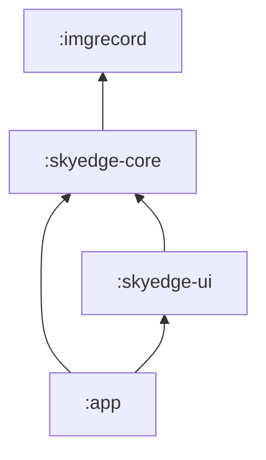
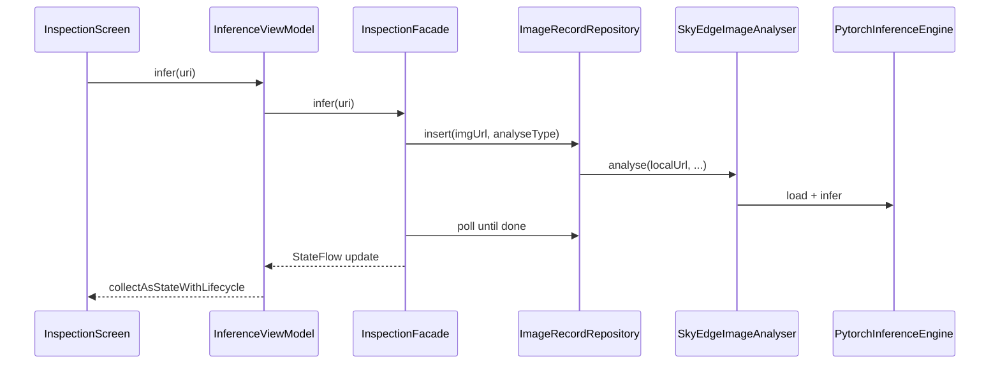

# SkyEdge 模块架构

本文描述 Android 端四模块划分、依赖边界与扩展方式。完整 JSON 字段约定见 [`openapi/api.yaml`](../openapi/api.yaml)。

## 模块依赖



| 模块 | 职责 | 禁止依赖 |
|------|------|----------|
| `:app` | Application 壳、`MainActivity` 入口、权限与 Manifest | 直接调用 PyTorch / Room DAO |
| `:skyedge-ui` | Compose 界面、薄 `InferenceViewModel` | PyTorch、`imgrecord`（经 Facade 间接使用） |
| `:skyedge-core` | 推理引擎、编排 `InspectionFacade`、`SkyEdgeImageAnalyser`、模型 assets | Compose、Coil |
| `:imgrecord` | Room、`ImageRecordRepository`、`ImageAnalyser` 接口 | UI 框架 |

## 包结构（skyedge-core）

```text
com.example.skyedge.core/
├── api/           # InspectionFacade、InspectionUiState、ModelChoice（UI 契约）
├── impl/          # InspectionFacadeImpl、FakeInspectionFacade
├── domain/        # InspectionResult
├── model/         # PytorchInferenceEngine、预处理与后处理
└── integration/   # SkyEdgeImageAnalyser
```

## 包结构（skyedge-ui）

```text
com.example.skyedge.ui/
└── inspection/
    ├── InspectionScreen.kt
    ├── InferenceViewModel.kt
    └── MaskOverlay.kt
```

## 运行时调用链



## InspectionFacade 方法

| 方法 | 说明 | OpenAPI 语义（若未来有服务端） |
|------|------|-------------------------------|
| `loadModel` / `switchModel` | 加载 Building / Road TorchScript | 端侧专有 |
| `infer(uri)` | 登记影像并同步等待分析完成 | `POST .../images` + 轮询至 `done` |
| `benchmark(uri, runs)` | 当前图连跑 N 次测时延 | 端侧专有 |
| `refreshHistory()` | 读取最近 Room 记录 | `GET .../images` |
| `close()` | 释放 PyTorch 模块 | 端侧专有 |

## summary_json 与 ImageRecord

| `summary_json` 字段 | `ImageRecord` / OpenAPI |
|---------------------|-------------------------|
| `local_url` | `localUrl` / `storagePath` |
| `mask_path` | 工作目录下 `mask.png` 绝对路径 |
| `analyse_type` | `analyseType`（building / road） |
| `defect_area_ratio` | `SegmentationSummary.defect_area_ratio` |
| `inference_ms` | `SegmentationSummary.inference_ms` |
| `model_version` | 实际加载的 `.pt` 资产路径 |

## 协同开发

- **UI 同学**：只依赖 `:skyedge-ui` + `InspectionFacade` 契约；可用 `FakeInspectionFacade` 做 Preview，无需安装 PyTorch。
- **端侧同学**：在 `:skyedge-core` 扩展 Facade 与推理；单元测试放 `skyedge-core/src/test`。
- **数据同学**：维护 `:imgrecord`；`ImageAnalyser` 由 core 实现。

## 扩展新功能

1. 在 `InspectionFacade` 增加方法与 `InspectionUiState` 字段。
2. 在 `InspectionFacadeImpl` 实现业务（可调 `ImageRecordRepository` / `SkyEdgeImageAnalyser`）。
3. 在 `InspectionScreen` 消费新状态；同步更新 `openapi/api.yaml` 中对应 schema。
4. 不引入远程 HTTP；地图瓦片等第三方 SDK 网络除外。

## 模型资产路径

TorchScript 与 `model_spec.json` 位于：

`skyedge-core/src/main/assets/models/`、`skyedge-core/src/main/assets/optimized/`

打包时由 Gradle 合并进 APK。
