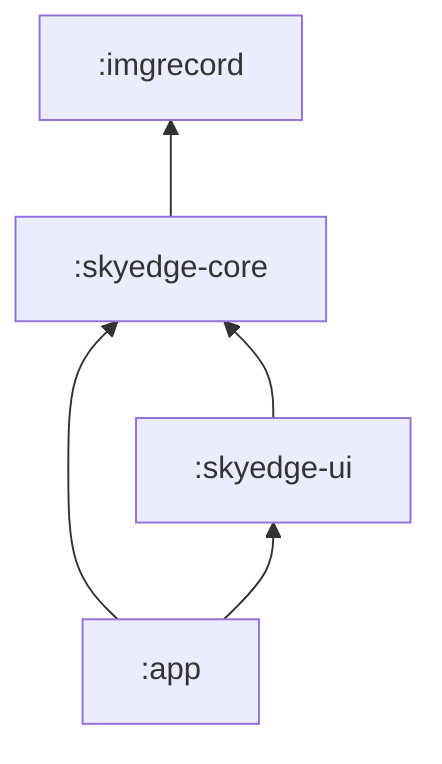
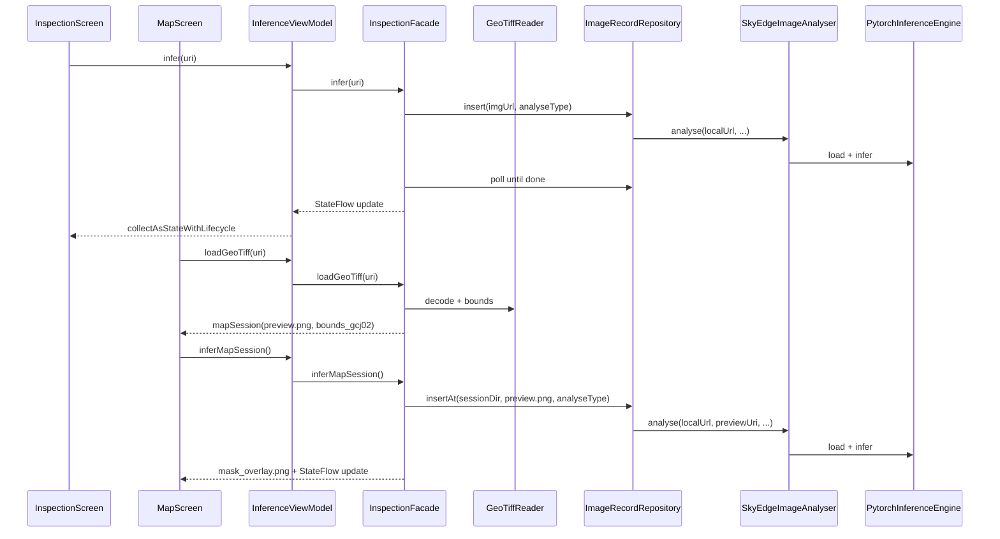
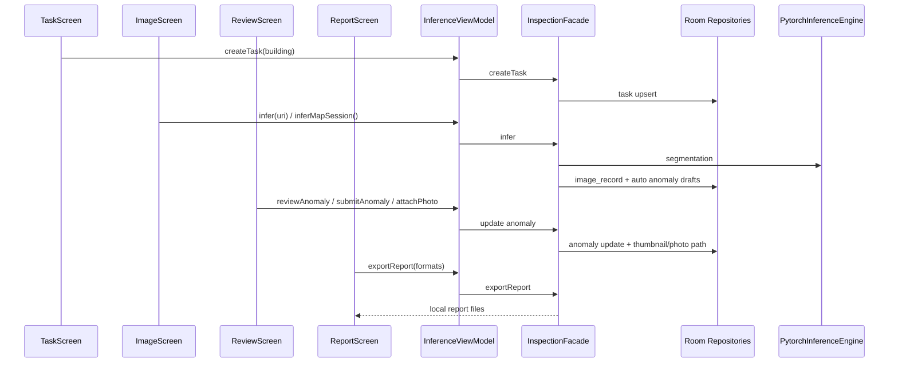

# SkyEdge 模块架构

本文描述 Android 端四模块划分、依赖边界与扩展方式。完整 JSON 字段约定见 [`openapi/api.yaml`](../openapi/api.yaml)。

## 模块依赖



| 模块 | 职责 | 禁止依赖 |
|------|------|----------|
| `:app` | Application 壳、`MainActivity` 入口、权限与 Manifest | 直接调用 PyTorch / Room DAO |
| `:skyedge-ui` | Compose 界面、薄 `InferenceViewModel` | PyTorch、`imgrecord`（经 Facade 间接使用） |
| `:skyedge-core` | 推理引擎、编排 `InspectionFacade`、`SkyEdgeImageAnalyser`、模型 assets | Compose、Coil |
| `:imgrecord` | Room、`ImageRecordRepository`、`ImageAnalyser` 接口 | UI 框架 |

## 包结构（skyedge-core）

```text
com.example.skyedge.core/
├── api/           # InspectionFacade、InspectionUiState、ModelChoice（UI 契约）
├── geo/           # GeoTIFF、GeoBounds、WGS84/GCJ-02、geo.json
├── impl/          # InspectionFacadeImpl、FakeInspectionFacade
├── domain/        # InspectionResult
├── model/         # PytorchInferenceEngine、预处理与后处理
└── integration/   # SkyEdgeImageAnalyser
```

## 包结构（skyedge-ui）

```text
com.example.skyedge.ui/
├── task/          # 任务列表、新建建筑/灾害任务
├── image/         # 统一影像入口：相册/无人机截图、GeoTIFF、样例图入口
├── review/        # 人工核查：bbox 框选、异常卡片、拍照取证入口
├── report/        # 报告预览/导出、灾害 GPS、双时相/SAM 入口
├── inspection/
│   ├── InspectionScreen.kt
│   ├── InferenceViewModel.kt
│   └── MaskOverlay.kt
└── map/
    ├── AMapCompose.kt
    ├── MapScreen.kt
    ├── MapOverlayManager.kt
    └── MapViewModel.kt
```

## 本地数据表（Phase 1+）

Room 数据库 `image_record.db` 当前版本为 v3：

| 表 | 职责 |
|----|------|
| `task` | 本地巡检任务；字段包含 `scene_type`、`status`、`priority`、`operator` |
| `image_record` | 影像推理记录；新增可空 `task_id`，历史记录可保持未归档 |
| `anomaly` | 建筑/灾害异常卡片；保存 bbox JSON、人工标签、复核状态、缩略图路径、照片路径 JSON |

`ImageRecordRepository` 仍负责影像推理记录；`TaskRepository` 与 `AnomalyRepository` 负责任务、卡片和照片绑定。生产默认 `autoAnalyse=true`，测试可关闭后台分析以显式验证更新路径。

## 运行时调用链



## 建筑核查闭环



GeoTIFF 地图核查时，`ImageScreen` 在存在 `mapSession` 后嵌入 `MapScreen`。地图点击通过 `MapAnomalyHitTest` 将 GCJ-02 坐标映射到归一化 bbox，命中后写入 `InspectionUiState.selectedAnomalyId`，供地图底部卡片与核查页共享选中状态。

## Phase 2 端侧入口

- 灾害范围：`startDisasterTrack()`、`captureCurrentLocation()`、`finishDisasterTrack()` 在端侧记录 GPS 点并在 GeoJSON 报告中输出闭合范围。
- 双时相：`setCompareImages()` 与 `setCompareSlider()` 提供历史图/本次图选择和卷帘位置状态。
- MobileSAM：`refineMaskAt()` 已保留点选入口；模型文件仍需算法侧交付后替换当前状态提示。

## InspectionFacade 方法

| 方法 | 说明 | OpenAPI 语义（若未来有服务端） |
|------|------|-------------------------------|
| `loadModel` / `switchModel` | 加载 Building / Road TorchScript | 端侧专有 |
| `infer(uri)` | 登记影像并同步等待分析完成 | `POST .../images` + 轮询至 `done` |
| `loadGeoTiff(uri)` | 读取 GeoTIFF，生成 `preview.png` 与 `geo.json`，更新 `mapSession` | 端侧专有 |
| `inferMapSession()` | 对当前地图会话的 `preview.png` 推理，生成 `mask_overlay.png` | 端侧专有 |
| `createTask` / `setActiveTask` / `listTasks` | 管理本地巡检任务与跨 Tab 活跃任务 | `POST/GET .../tasks` |
| `submitAnomaly` / `reviewAnomaly` / `updateAnomaly` | 提交、确认/排除、更新异常卡片 | `/tasks/{taskId}/anomalies` |
| `attachPhoto` | 复制现场照片到任务目录并绑定异常 | 端侧专有 |
| `exportReport(taskId, formats)` | 导出 image/json/csv/pdf/geojson | `POST /reports` |
| `startDisasterTrack` / `captureCurrentLocation` / `finishDisasterTrack` | 端侧 GPS 范围采集 | 端侧专有 |
| `setCompareImages` / `setCompareSlider` / `refineMaskAt` | 双时相与 SAM 点选入口 | 端侧专有 |
| `setMapLayerVisibility` / `setMaskAlpha` | 控制高德 `GroundOverlay` 展示 | 端侧 UI 状态 |
| `benchmark(uri, runs)` | 当前图连跑 N 次测时延 | 端侧专有 |
| `refreshHistory()` | 读取最近 Room 记录 | `GET .../images` |
| `close()` | 释放 PyTorch 模块 | 端侧专有 |

## summary_json 与 ImageRecord

| `summary_json` 字段 | `ImageRecord` / OpenAPI |
|---------------------|-------------------------|
| `local_url` | `localUrl` / `storagePath` |
| `mask_path` | 工作目录下 `mask.png` 绝对路径 |
| `analyse_type` | `analyseType`（building / road） |
| `defect_area_ratio` | `SegmentationSummary.defect_area_ratio` |
| `inference_ms` | `SegmentationSummary.inference_ms` |
| `model_version` | 实际加载的 `.pt` 资产路径 |
| `geo` | GeoTIFF 元数据：`bounds_wgs84` 为真源，`bounds_gcj02` 用于高德展示 |
| `geo.ortho_preview_path` | 地图正射 `GroundOverlay` 源图 |
| `geo.mask_overlay_path` | 与正射同 bounds 的 RGBA mask overlay |

## 协同开发

- **UI 同学**：只依赖 `:skyedge-ui` + `InspectionFacade` 契约；可用 `FakeInspectionFacade` 做 Preview，无需安装 PyTorch。
- **端侧同学**：在 `:skyedge-core` 扩展 Facade 与推理；单元测试放 `skyedge-core/src/test`。
- **数据同学**：维护 `:imgrecord`；`ImageAnalyser` 由 core 实现。

## 扩展新功能

1. 在 `InspectionFacade` 增加方法与 `InspectionUiState` 字段。
2. 在 `InspectionFacadeImpl` 实现业务（可调 `ImageRecordRepository` / `SkyEdgeImageAnalyser`）。
3. 在 `InspectionScreen` / `MapScreen` 消费新状态；同步更新 `openapi/api.yaml` 中对应 schema。
4. 不引入远程 HTTP；地图瓦片等第三方 SDK 网络除外。

## 模型资产路径

TorchScript 与 `model_spec.json` 位于：

`skyedge-core/src/main/assets/models/`、`skyedge-core/src/main/assets/optimized/`

打包时由 Gradle 合并进 APK。
