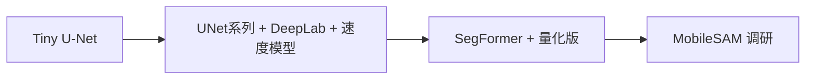

# 算法模型交付清单

按本清单交付模型，端侧用于离线加载与 mask 验收。  
**单发本文档即可**，内含目录结构、通用规范、各模型要求与 MobileSAM 例外说明。

---

## 一、总交付包（一个 zip）

```
skyedge_models_delivery/
├── README.txt                      # 总说明：类别定义、统一 IoU 阈值、训练数据版本
├── shared_acceptance/              # 共用验收集（所有分割模型同一套图）
│   ├── input_01.jpg
│   ├── input_01_mask.png         # 单通道类别索引，见第三节
│   ├── input_02.jpg
│   ├── input_02_mask.png
│   └── ...（至少 5 组，建议 10 组）
├── models/
│   ├── 01_tiny_unet/
│   ├── 02_unet_mobilenet/
│   ├── 03_unet_efficientnet/      # 与 02 二选一或都交
│   ├── 04_deeplabv3_mobilenet/
│   ├── 05_segformer_b0/
│   ├── 06_fast_scnn/
│   ├── 07_bisenet/
│   └── 08_mobile_sam/             # 交互模型，规范见第七节
└── export_scripts/                 # 建议：每个模型一键导出 .pt 的脚本
    ├── export_tiny_unet.py
    └── ...
```

端侧放入工程：`skyedge-core/src/main/assets/models/<name>/*.pt`，每个模型一份 `model_spec.json`（见下文）。

---

## 二、模型全量清单（都要交）

| 序号 | 模型 | 目录名 | 用途 | 优先级 |
|------|------|--------|------|--------|
| 1 | **Tiny U-Net** | `01_tiny_unet` | 先跑通流程 | P0（最先交） |
| 2 | **U-Net + MobileNet encoder** | `02_unet_mobilenet` | 精度主力候选 | P1 |
| 3 | **U-Net + EfficientNet encoder** | `03_unet_efficientnet` | 精度对比 | P1 |
| 4 | **DeepLabV3+ MobileNet** | `04_deeplabv3_mobilenet` | 经典分割 baseline | P1 |
| 5 | **SegFormer-B0** | `05_segformer_b0` | 精度对比 | P2 |
| 6 | **Fast-SCNN** | `06_fast_scnn` | 速度备选 | P1 |
| 7 | **BiSeNet** | `07_bisenet` | 速度备选 | P1 |
| 8 | **MobileSAM** | `08_mobile_sam` | 交互修正调研 | P2（格式见第七节） |

**说明**：P0 交齐即可开端侧联调；P1/P2 可分批 zip，但**最终需 1～7 全部到齐**（8 为调研项，单独约定是否必交）。

---

## 三、每个分割模型子目录（01～07 相同规范）

```
01_tiny_unet/
├── tiny_unet_mobile.pt           # TorchScript，文件名与 spec 一致
├── model_spec.json               # 必交
├── metrics.json                  # 建议：mIoU、参数量、FLOPs、训练集版本
└── notes.txt                     # 可选：与验收集预处理差异说明
```

### 3.1 `*.pt` 通用要求

| 项 | 要求 |
|----|------|
| 格式 | TorchScript，`traced._save_for_lite_interpreter(...)` |
| 设备 | CPU 上 trace，`model.eval()` |
| 输入 | `(1, 3, H, W)` float32，RGB，NCHW |
| 输出 | **`(1, C, H, W)` logits**（端侧 argmax，不要只交彩色可视化图当唯一输出） |
| 任务类型 | `task_type: "segmentation"` |

**导出参考**

```python
import torch
from torch.utils.mobile_optimizer import optimize_for_mobile

model.eval()
example = torch.randn(1, 3, H, W)
traced = torch.jit.trace(model, example)
traced = optimize_for_mobile(traced)
traced._save_for_lite_interpreter("tiny_unet_mobile.pt")
```

### 3.2 `model_spec.json`（每个模型一份）

```json
{
  "model_id": "tiny_unet_v1",
  "asset_file": "models/01_tiny_unet/tiny_unet_mobile.pt",
  "task_type": "segmentation",
  "input": {
    "layout": "NCHW",
    "height": 256,
    "width": 256,
    "mean": [0.485, 0.456, 0.406],
    "std": [0.229, 0.224, 0.225],
    "rgb_order": "RGB"
  },
  "output": {
    "type": "segmentation_logits",
    "postprocess": "argmax",
    "threshold": null
  },
  "num_classes": 2,
  "class_names": ["background", "defect"]
}
```

| 字段 | 说明 |
|------|------|
| `model_id` | 全局唯一，建议 `架构_编码器_版本` |
| `asset_file` | 相对 `assets/` 的路径，端侧按此加载 |
| `input.height/width` | 与该模型 trace 尺寸一致（允许模型间不同） |
| `mean` / `std` | 必须与 Python 推理一致 |
| `num_classes` | 含背景，全项目统一（除非书面变更） |

**全项目约定（请写在总 README.txt）**

- 类别数、类别名、缺陷定义所有模型一致。
- 验收集 `shared_acceptance/` 对所有模型共用；若某模型输入尺寸不同，请交 **`acceptance_preprocess.md`** 说明 Python 如何 resize/归一化。

### 3.3 验收 mask 格式（`shared_acceptance`）

| 项 | 要求 |
|----|------|
| 格式 | PNG，**单通道 8bit**，像素值 = 类别 id（0=背景，1=缺陷，…） |
| 禁止 | 仅交彩色可视化图、无类别索引 |
| 尺寸 | 与**该模型输出 H×W** 一致；若与输入图不同，在 README 说明 |
| 阈值 | 总 README 写明，例如 **mean IoU ≥ 0.95** |

端侧对每张验收图跑推理，用 `tools/verify_mask.py` 与你的 `*_mask.png` 对比。

### 3.4 `metrics.json`（建议，便于选型）

```json
{
  "model_id": "tiny_unet_v1",
  "miou_val": 0.82,
  "params_m": 1.2,
  "flops_g": 0.5,
  "latency_ms_cpu": 45,
  "input_size": [256, 256]
}
```

---

## 四、各模型补充说明（算法填写）

| 模型 | 建议输入尺寸 | 备注 |
|------|--------------|------|
| Tiny U-Net | 256×256 或 512×512 | P0，先定项目默认尺寸 |
| U-Net + MobileNet | 与 Tiny 对齐或 512 | 写明 encoder 版本（如 v2） |
| U-Net + EfficientNet | 同上 | 写明 B0～B4 |
| DeepLabV3+ MobileNet | 513 或 512 | output_stride、是否 ASPP 标准实现 |
| SegFormer-B0 | 512 常见 | 体积大，注明是否已蒸馏 |
| Fast-SCNN | 1024×512 或 512×512 | 实时场景尺寸写清 |
| BiSeNet | 同上 | 注明 BiSeNetv1/v2 |

**端侧会做**：同一验收集、逐模型加载、记录真机延迟与 mask 一致性（不负责训练）。

---

## 五、可选：量化模型（每架构可追加）

在对应目录下可增加（命名规范）：

```
tiny_unet_mobile_fp32.pt
tiny_unet_mobile_dynamic_int8.pt   # 动态量化
tiny_unet_mobile_static_int8.pt  # 静态量化（需校准集，可与 shared_acceptance 同源）
```

每个量化文件仍要 **更新 `model_spec.json` 的 `asset_file`** 或增加 `model_spec_static_int8.json`。  
校准集：从 `shared_acceptance` 抽图即可。

---

## 六、勿交 / 不接受（分割模型 01～07）

- 仅 `.pth` 无 TorchScript（除非附带可复现 export 脚本）
- 无 `model_spec.json` 或 mean/std/H/W 与 Python 不一致
- 输出不是 `[1,C,H,W]` logits 且未在 spec 中说明特殊后处理
- 只有 ONNX/TFLite 而无 `.pt`（全量清单以 **PyTorch Mobile 为主**；若某模型只能 ONNX，需单独书面说明）

---

## 七、MobileSAM（08，单独规范）

与 01～07 **不同**，属于交互式调研，允许分期交付。

| 项 | 要求 |
|----|------|
| 最低交付 | 模型权重 + **推理说明**（点 prompt / box prompt 格式） |
| 格式 | TorchScript 或 .pt；若需多步推理，交 **伪代码或 Python demo** |
| 输入 | 图像 + prompt 坐标（JSON schema 示例） |
| 输出 | mask 或 logits，写明 shape |
| 验收 | 至少 2 组「图 + 点/框 + 参考 mask」 |
| 端侧 | 第一期可能仅 PC 验证，App 集成另排期 |

```
08_mobile_sam/
├── mobile_sam.pt
├── model_spec.json          # task_type 可为 "interactive_segmentation"
├── prompt_schema.json       # 坐标格式
├── demo/                    # 图 + prompt + mask 示例
└── README.md
```

---

## 八、交付顺序建议（算法排期）



1. **P0**：`01_tiny_unet` + `shared_acceptance` + 总 README  
2. **P1**：`02`～`04`、`06`、`07`  
3. **P2**：`05_segformer_b0`、各模型 int8（可选）  
4. **P3**：`08_mobile_sam`  

每批 zip 注明批次号，避免覆盖旧文件。

---

## 九、交付前自检（每个模型）

- [ ] CPU 上 `torch.jit.load(pt)` 可 `forward(1,3,H,W)`
- [ ] 输出 shape `(1, C, H, W)`，C = `num_classes`
- [ ] 对 `shared_acceptance` 每张图可生成与交付 mask 一致的 `*_mask.png`
- [ ] `model_spec.json` 与导出脚本参数一致
- [ ] `metrics.json` 已填（建议）

---

## 十、常见问题

**Q：全交工作量很大，能否只交部分？**  
A：端侧选型需要 **1～7 全部**；至少先交 P0+P1，其余按第八节批次补全。

**Q：encoder 两个版本都交吗？**  
A：`02` 与 `03` 至少交一个；两个都交更好对比。

**Q：验收 mask 每模型要单独一套吗？**  
A：**推荐共用 `shared_acceptance`**；若某模型预处理不同，交同图下你方预处理后的 mask 子目录，并在 README 说明。

---

## 十一、端侧收到后（给你参考）

1. 拷贝至 `skyedge-core/src/main/assets/models/<model_id>/`  
2. 在 App 内切换 Building / Road 模型，用同一张图对比效果  
3. `python tools/verify_mask.py` 逐模型验收 mask  

---

**联系人**：端侧部署（路径、`model_spec`、验收失败对齐）
