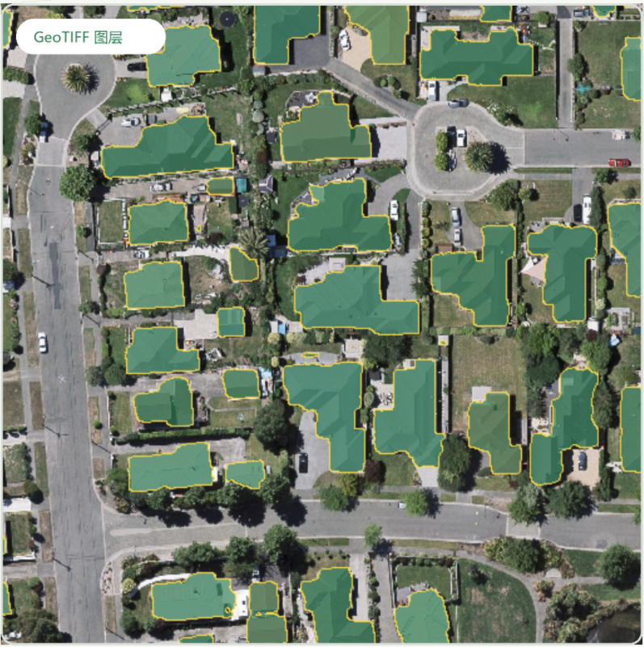
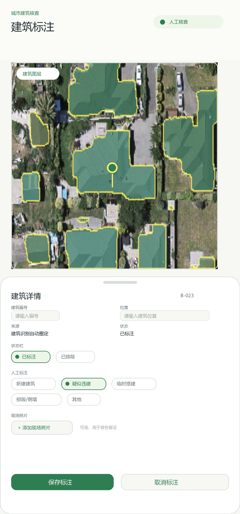
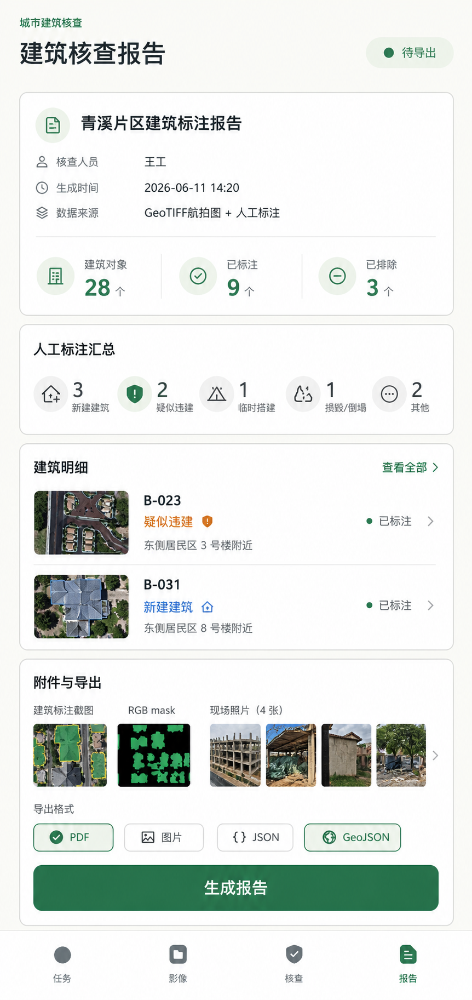
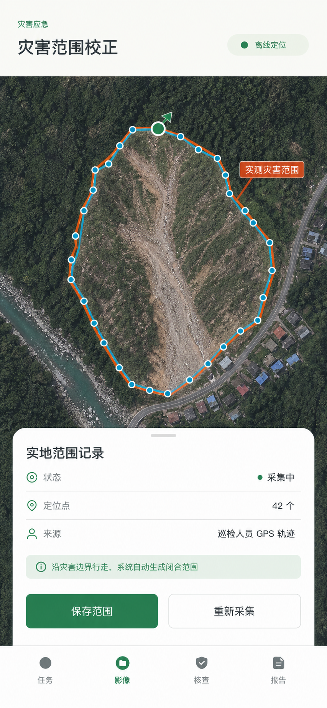
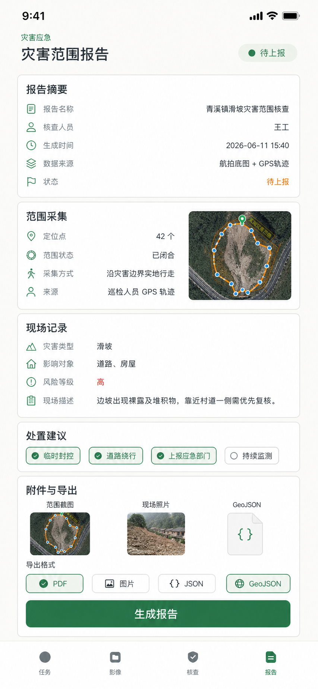

# SkyEdge 功能规划 TODO

本文档记录**未来功能**的实现规划，按阶段与模块拆分。已完成能力见 [`README.md`](../README.md)；架构边界见 [`ARCHITECTURE.md`](ARCHITECTURE.md)；字段契约见 [`openapi/api.yaml`](../openapi/api.yaml)。

**原则**：App 运行时推理、存储、报告生成均不依赖远程 HTTP 后端（地图 SDK 瓦片除外）。需跨设备/跨人员协同的能力单独标注，并给出端侧替代方案。

---

## 产品目标摘要（来源：`docs/goals/`）

> 来源：`基层低空影像智能核查系统_技术报告_2版.docx`、`SkyEdge_低空影像智能巡检系统_修正版.pptx`、示例渲染图 04/08/14/18/23。

### 愿景与定位

面向**基层低空巡检、城市建筑核查、灾害应急复核**人员，打造以移动端为核心的低空航拍影像智能核查系统。强调**弱网可用、本地推理、数据安全、人机协同复核、结构化导出**，将空天信息应用从专业后台平台延伸到一线现场。

**端侧闭环**（八步）：

```text
影像导入 → 智能识别 → 图层叠加 → 交互核查 → 记录确认 → 拍照存档 → 报告生成 → 离线导出
```

**核心用户**：城管、住建、应急、交通巡查等基层一线人员；替代「无人机采集 → 数据回传 → 服务器分析 → 专业 GIS 复核」的长链路。

**业务目标**：

1. 降低 GIS 使用门槛，弱网/数据敏感条件下仍可核查与出报告
2. 提升基层巡检效率，减少人工逐栋圈选成本
3. 现场证据、空间范围、人工结论标准化、可追溯

### 系统分层（目标架构）

| 层级 | 职责 |
|------|------|
| 用户交互层 | 地图展示（AMap）、图层管理、记录卡片、底部四 Tab 导航 |
| 影像地图层 | 本地图片 / GeoTIFF / 地图底图 / GPS 轨迹 / 矢量范围叠加 |
| AI 推理层 | 建筑物（U-Net + EfficientNet-B0）、道路分割；P2 MobileSAM 点选修正 |
| 业务数据层 | 任务、建筑对象、灾害范围、现场照片、人工标注、导出状态 |
| 报告导出层 | PDF、图片、JSON、CSV、GeoJSON |

### 场景一：城市建筑核查

**流程**：导入航拍/GeoTIFF → 建筑 mask 自动提取 → 地图叠加 → 点击建筑对象 → 人工标注确认/排除 → 拍照取证 → 导出建筑核查报告。

**GeoTIFF 图层 + 建筑 mask 叠加**（目标 UI）：



**建筑标注交互卡片**（目标 UI）：



卡片字段与交互要求：

- 建筑编号（如 `B-023`）、位置、来源（「建筑识别自动圈定」）、状态（**已标注** / **已排除**）
- 人工标注类型：**新建建筑**、**疑似违建**、**临时搭建**、**损毁/倒塌**、**其他**
- 可选添加现场照片（报告留证）
- 操作：保存标注 / 取消标注

**建筑核查报告**（目标 UI）：



报告内容要求：

- 摘要：报告名称、核查人员、生成时间、数据来源（GeoTIFF + 人工标注）
- 统计：建筑对象总数、已标注 / 已排除数量
- 人工标注汇总（按类型计数）
- 建筑明细列表（编号、类型、位置、缩略图、状态）
- 附件：标注截图、RGB mask、现场照片
- 导出格式：PDF / 图片 / JSON / **GeoJSON**

→ 对应 TODO：**P1-IMPORT**、**P1-ANNOTATE**、**P1-MASK**、**P1-CAMERA**、**P1-REPORT**、**P1-UI**

### 场景二：灾害应急范围校正

**痛点**：航拍疑似灾害范围与实际地面边界不一致。

**流程**：导入航拍底图 → 巡检人员沿灾害边界实地行走 → 离线采集 GPS 轨迹 → 系统自动生成闭合实测范围 → 叠加在底图上 → 填写现场记录与处置建议 → 导出灾害范围报告。

**灾害范围校正**（目标 UI）：



采集要求：

- 离线定位状态提示
- 沿边界行走，实时记录定位点（如 42 个）
- 来源：巡检人员 GPS 轨迹；状态：采集中 → 已闭合
- 实测范围与航拍范围叠加显示
- 操作：保存范围 / 重新采集

**灾害范围报告**（目标 UI）：



报告内容要求：

- 摘要：报告名称、核查人员、生成时间、数据来源（航拍底图 + GPS 轨迹）、状态（待上报）
- 范围采集：定位点数、范围状态（已闭合）、采集方式、来源
- 现场记录：灾害类型、影响对象、风险等级、现场描述
- 处置建议：临时封控、道路绕行、上报应急部门、持续监测等（可多选标签）
- 附件：范围截图、现场照片、**GeoJSON 范围文件**
- 导出格式：PDF / 图片 / JSON / GeoJSON

→ 对应 TODO：**P2-DISASTER**、**P2-GPS**、**P2-REPORT**

### 技术要点（来自技术报告）

| 能力 | 方案 | 阶段 |
|------|------|------|
| GeoTIFF 地图叠加 | 读取 CRS/仿射变换，WGS84 → GCJ-02，GroundOverlay | Phase 0 ✓ |
| 建筑分割 | U-Net + EfficientNet-B0，512×512，阈值 0.75，F1≈0.91 | Phase 0 ✓ |
| mask 对象化 | 连通域分析 → 单栋建筑 bbox/多边形 | Phase 1 |
| 交互修正 | MobileSAM 点选/框选 refine mask | Phase 2 |
| GPS 轨迹面化 | 排序、去噪、闭合、生成多边形范围 | Phase 2 |

### 远期规划（需架构决策）

技术报告/PPT 提及的**第二阶段 Web 管理端**（任务下发、人员管理、进度查看、报告归档、多端协同）**超出本 App 无远程服务器原则**，暂缓标注为 `[-]`，端侧替代为离线文件包互传（见 P3-SYNC-01）。

---

## 状态图例

- `[x]` 已完成（Phase 0）
- `[ ]` 待实现
- `[-]` 暂缓 / 需决策

---

## Phase 0 — 基线（已完成）

- [x] 相册选图 + Building / Road 端侧分割（PyTorch Mobile，512×512）
- [x] 原图与 mask 叠加并排预览（`InspectionScreen`）
- [x] GeoTIFF 导入 + WGS84 → GCJ-02 + 高德卫星 `GroundOverlay`（`MapScreen`）
- [x] mask 图层开关、透明度调节（`setMapLayerVisibility` / `setMaskAlpha`）
- [x] mask 回映射至 preview 尺寸，生成 `mask_overlay.png`
- [x] Room 落库：`ImageRecordRepository`、`summary_json`、`refreshHistory()`
- [x] OpenAPI v0.1 字段约定；v0.2 Task / Anomaly / Report 端侧接口已部分落地

---

## Phase 1 — 第一版交互（MVP）

目标：支撑**场景一（违建识别 / 建筑核查）**的最小闭环——加载 → 识别 → 人工框选标注 → 拍照 → 导出基础报告。UI 对齐 `docs/goals/` 渲染图与 PPT 原型。

> 状态：除 **P1-E2E-01 真机验收**（需连接物理设备人工走查）外，Phase 1 功能项已全部实现并通过 `:app:compileDebugKotlin` 与 `:imgrecord` / `:skyedge-core` 单元测试。

### 1.0 导航与页面骨架

- [x] **P1-UI-01** 底部四 Tab 导航：任务 / 影像 / 核查 / 报告
  - 模块：`skyedge-ui`
  - 说明：对齐渲染图底部导航；各 Tab 承载任务列表、影像查看、标注核查、报告预览

- [x] **P1-UI-02** 任务首页：任务名称、状态徽章（如「人工核查」「待导出」）、快捷入口
  - 模块：`skyedge-ui`
  - 说明：对应 PPT「任务」页与建筑/灾害两类任务模板

### 1.1 影像导入与入口

- [x] **P1-IMPORT-01** 统一影像来源入口：相册、无人机截图、内置样例图
  - 模块：`skyedge-ui`（选图 UI）、`app`（权限）
  - 说明：样例图放 `assets/sample_images/`，免权限演示
  - 当前：相册/无人机截图、GeoTIFF 与内置样例图入口已完成；样例图由 `assets/sample_images/` 规格文件端侧渲染后进入同一推理链路

- [x] **P1-IMPORT-02** 任务/会话概念落地（对齐 OpenAPI `Task`）
  - 模块：`imgrecord`（新表或扩展）、`skyedge-core`（`InspectionFacade`）
  - 说明：一次巡检对应一个 `taskId`，多张图挂在任务下

### 1.2 人工框选与记录卡片

- [x] **P1-ANNOTATE-01** 框选手势：在原图/mask 画布上绘制归一化 `BoundingBox`
  - 模块：`skyedge-ui`（手势层）
  - 契约：`openapi` → `BoundingBox`（x/y/width/height，0~1）

- [x] **P1-ANNOTATE-02** 记录卡片 UI：类型、严重程度、备注、确认/驳回
  - 模块：`skyedge-ui`
  - 契约：`Anomaly`、`ReviewAnomalyRequest`、`ReviewStatus`
  - 建筑场景人工标注类型：**新建建筑**、**疑似违建**、**临时搭建**、**损毁/倒塌**、**其他**（对齐渲染图 04）
  - 状态切换：**已标注** / **已排除**
  - 当前：类型、备注、严重程度、确认/排除已完成

- [x] **P1-ANNOTATE-02b** 建筑对象卡片字段：编号（`B-xxx`）、位置、来源（自动圈定）、缩略图
  - 模块：`skyedge-ui`、`skyedge-core`
  - 说明：点击地图建筑 mask 弹出底部卡片（见渲染图 04）
  - 当前：编号/位置/来源/缩略图已落库并可编辑；核查画布与 GeoTIFF 地图均支持点击命中 bbox 选中卡片

- [x] **P1-ANNOTATE-03** `InspectionFacade` 扩展：提交/更新/列出异常卡片
  - 模块：`skyedge-core/api`、`InspectionFacadeImpl`
  - 建议 API：`submitAnomaly(...)`、`reviewAnomaly(id, status, comment)`、`listAnomalies(sessionId)`

- [x] **P1-ANNOTATE-04** 异常数据落库（Room）
  - 模块：`imgrecord`
  - 说明：独立 `Anomaly` 表，关联 `local_url` / `taskId`；不全部塞进 `summary_json`

### 1.3 mask 实例化（简化版）

- [x] **P1-MASK-01** 连通域拆分：整图 mask → 多个 bbox 候选
  - 模块：`skyedge-core`（后处理）
  - 说明：第一版可用 OpenCV/Bitmap 扫描，不必等 MobileSAM

- [x] **P1-MASK-02** 每个实例自动生成卡片草稿（`reviewStatus=pending`）
  - 模块：`skyedge-core` + `skyedge-ui`
  - 说明：用户可确认违建或驳回

### 1.4 现场拍照存档

- [x] **P1-CAMERA-01** 核查流程内调起相机拍照
  - 模块：`skyedge-ui`、`app`（`CAMERA` 权限）

- [x] **P1-CAMERA-02** 照片与任务/异常卡片绑定，落盘至会话目录
  - 模块：`imgrecord`、`InspectionFacadeImpl`
  - 路径建议：`filesDir/analysis/<uuid>/photos/<anomalyId>.jpg`

### 1.5 离线报告导出（最小形态）

- [x] **P1-REPORT-01** 长图报告：原图 + mask 叠加 + 标注框截图拼接
  - 模块：`skyedge-core`（合成）、`skyedge-ui`（预览/分享）
  - 当前：已生成包含原图、mask 叠加、bbox 与建筑明细的 PNG 长图报告，并可在报告页预览

- [x] **P1-REPORT-02** JSON 结构化导出：异常列表、核查结论、时间/地理元数据
  - 模块：`skyedge-core`
  - 契约：对齐 `ReportSummary`、`Anomaly`

- [x] **P1-REPORT-02b** 建筑核查报告页：统计摘要、按类型汇总、建筑明细列表、附件预览
  - 模块：`skyedge-ui`、`skyedge-core`
  - 说明：对齐渲染图 18（对象数、已标注/已排除、各类型计数、明细行）
  - 当前：统计摘要、按类型汇总、建筑明细列表、现场照片附件与长图预览已完成

- [x] **P1-REPORT-03** 导出到相册 / 系统分享（`MediaStore` / `ACTION_SEND`）
  - 模块：`skyedge-ui`、`app`

- [x] **P1-REPORT-04** `InspectionFacade.exportReport(formats)` 端侧实现
  - 模块：`skyedge-core`
  - 契约：对齐 `CreateReportRequest`、`ReportFormat`（第一版 `image` + `json`；GeoJSON 见 P2-REPORT-03）

- [x] **P1-REPORT-05** 报告状态流转：草稿 → 待导出 → 已导出（建筑）；待上报（灾害）
  - 模块：`skyedge-ui`、`imgrecord`

### 1.6 场景一串联验收

- [ ] **P1-E2E-01** 违建识别端到端：定位元数据（GeoTIFF bounds）→ 加载 → Building 推理 → 卡片确认 → 拍照 → 导出
  - 依赖：P1-IMPORT、P1-ANNOTATE、P1-MASK、P1-CAMERA、P1-REPORT
  - 当前：代码链路已补齐并通过 `:app:compileDebugKotlin`；仍需连接真机执行完整端到端验收

---

## Phase 2 — 场景深化

目标：双时相对比、精细交互、定位绑定、结构化报告完善。

### 2.1 历史 vs 本次影像对比

- [ ] **P2-COMPARE-01** 双图会话：选择历史记录 + 本次新图
  - 模块：`skyedge-ui`、`InspectionFacade`
  - 契约：`LayerBundle`（`original` + `change`）
  - 当前：已保留历史图/本次图选择状态；尚未接入历史记录选择和 `LayerBundle`

- [ ] **P2-COMPARE-02** 移动端卷帘对比（划屏/拖动切换两时相）
  - 模块：`skyedge-ui`
  - 当前：已有卷帘滑块状态；尚未渲染双图卷帘画面

- [ ] **P2-COMPARE-03** 变化图层生成（像素差分或算法侧 change mask）
  - 模块：`skyedge-core`、算法交付
  - 说明：滞后性大时需 UI 提示「时相差过久，仅供参考」

### 2.2 点选交互与 MobileSAM

- [ ] **P2-SAM-01** 算法交付 MobileSAM TorchScript（`08_mobile_sam`）
  - 模块：算法侧 → `skyedge-core/assets`

- [ ] **P2-SAM-02** 点选坐标传入推理引擎，refine 单实例 mask
  - 模块：`skyedge-core/model`、`InspectionFacade`

- [ ] **P2-SAM-03** 点选与 mask 卡片联动（点击 mask 高亮对应卡片）
  - 模块：`skyedge-ui`
  - 当前：核查画布与 GeoTIFF 地图已支持点击命中 bbox 高亮对应卡片（`MapAnomalyHitTest` + `selectedAnomalyId`）；尚缺基于 SAM 的 mask 像素级点选精修

### 2.3 手机 GPS 定位

- [x] **P2-GPS-01** 获取当前 GPS，写入任务/报告元数据
  - 模块：`skyedge-ui`、`app`（`ACCESS_FINE_LOCATION`）

- [ ] **P2-GPS-02** GPS 与地图视口联动（无 GeoTIFF 时定位到当前位置）
  - 模块：`skyedge-ui/map`
  - 当前：可采集定位点；尚未联动地图视口

### 2.4 报告格式扩展

- [x] **P2-REPORT-01** CSV 导出（异常表格式）
  - 契约：`ReportFormat.csv`

- [ ] **P2-REPORT-02** PDF 报告（图文混排 + 统计摘要）
  - 契约：`ReportFormat.pdf`
  - 说明：可用 Android `PdfDocument` 或轻量库；建筑/灾害两类报告模板（见渲染图 08、18）
  - 当前：已生成基础 PDF 摘要；图文混排模板尚未完成

- [ ] **P2-REPORT-03** GeoJSON 空间对象导出（建筑多边形、灾害范围、GPS 轨迹）
  - 契约：新增或扩展 `ReportFormat.geojson`
  - 说明：技术报告要求灾害报告附带 GeoJSON 范围文件，建筑对象亦可矢量化导出
  - 当前：已导出基础 GeoJSON；建筑 bbox 仍是归一化坐标，尚未转换为真实地理多边形

### 2.5 地图与地理能力增强

- [x] **P2-GEO-01** GeoTIFF 支持 LZW/Deflate 压缩
  - 模块：`skyedge-core/geo/GeoTiffReader`

- [ ] **P2-GEO-02** 建筑物 + 道路同图双图层（串行推理或双模型叠加 UI）
  - 模块：`skyedge-core`、`skyedge-ui`

- [ ] **P2-GEO-03** 地图放大查看：mask 区域 pinch-zoom 细节
  - 模块：`skyedge-ui/map`

### 2.6 场景二（灾情响应）— 端侧部分

- [ ] **P2-DISASTER-01** 灾情框选：人工框选 bbox → 灾情卡片（`AnomalyType.debris` 等）
  - 模块：同 P1-ANNOTATE
  - 当前：人工 bbox 与通用异常表已完成；灾情专用类型 UI（debris/landslide 等）尚未完成

- [ ] **P2-DISASTER-02** 灾情 severity 人工标注 + 端侧规则辅助打分
  - 模块：`skyedge-core`、`skyedge-ui`
  - 说明：不依赖服务端严重程度算法
  - 当前：数据模型预留 `severity`；灾情 severity UI 与端侧规则尚未完成

- [ ] **P2-DISASTER-03** 本地多人 GPS 记录列表（单次任务内多次提交定位点）
  - 模块：`imgrecord`、`skyedge-core`
  - 说明：端侧仅存本地；聚合范围用简单凸包/中心点估算
  - 当前：单次内存 GPS 轨迹已完成；多人/多次记录列表与持久化尚未完成

- [ ] **P2-DISASTER-04** GPS 轨迹闭合面化：排序、去噪、沿边界行走采集 → 实测灾害范围多边形
  - 模块：`skyedge-core`、`skyedge-ui`
  - 说明：对齐渲染图 14；离线定位、采集中/已闭合状态、保存/重新采集
  - 当前：采集/闭合状态与 GeoJSON 闭合输出已完成；排序、去噪、面化算法与持久化尚未完成

- [ ] **P2-DISASTER-05** 灾害范围报告：范围采集摘要、现场记录、处置建议标签、风险等级
  - 模块：`skyedge-ui`、`skyedge-core`
  - 说明：对齐渲染图 08；处置建议多选（临时封控、道路绕行、上报应急部门、持续监测等）
  - 当前：报告 JSON 可包含轨迹；现场记录表单、处置建议标签和灾害报告模板尚未完成

- [ ] **P2-DISASTER-06** 实测范围与航拍疑似范围叠加显示（双图层对比）
  - 模块：`skyedge-ui/map`
  - 说明：技术报告「灾害范围 GPS 轨迹校正」核心交互
  - 当前：尚未在地图上绘制实测范围与疑似范围双图层

---

## Phase 3 — 协同与体验升级（可选）

以下项与「无远程服务器」原则可能冲突，实施前需产品/架构决策。

### 3.1 跨人员协同

- [ ] **[-] P3-SYNC-01** 多人定位聚合 → 灾情范围纠偏（跨设备）
  - 备选 A：离线文件包导出/导入（JSON + 照片，人工汇总）
  - 备选 B：独立协同服务（**超出本 App 核心范围**）

- [ ] **[-] P3-SYNC-02** 人员调度系统对接
  - 说明：配套服务端，不在 `skyedge-*` 模块内实现

### 3.2 体验与模型扩展

- [ ] **[-] P3-UX-01** 3D 旋转地球入口（替代或补充现有 2D 高德地图）
  - 说明：需求描述中的「3D 地球」；评估 Cesium/Mapbox GL / 自研成本

- [ ] **[-] P3-MODEL-01** 地物分类（树木、车辆等）
  - 说明：需新模型或 SAM + 文本提示，不在当前 building/road 范围

- [ ] **P3-MODEL-02** 变化检测专用模型接入
  - 模块：`skyedge-core`、算法交付

---

## 按架构分层汇总

| 层级 | 模块 | Phase 1 重点 TODO |
|------|------|-------------------|
| 用户交互层 | `skyedge-ui` | 四 Tab 导航、框选、建筑/灾害卡片、拍照、报告预览/分享、样例图入口 |
| 业务逻辑层 | `skyedge-core` | `submitAnomaly`、`exportReport`、mask 实例拆分 |
| 推理引擎层 | `skyedge-core/model` | 连通域后处理；Phase 2 MobileSAM |
| 数据存储层 | `imgrecord` | `Task`、`Anomaly`、拍照附件、报告作业 |

---

## 依赖与阻塞

| TODO | 阻塞项 |
|------|--------|
| P2-SAM-* | 算法侧 `08_mobile_sam` TorchScript 交付 |
| P2-COMPARE-03 / P3-MODEL-02 | 变化检测模型交付 |
| P1-E2E-01 | 真机端到端验收 |
| P2-GPS-02 / P2-DISASTER-06 | 地图视口与范围覆盖物绘制 |
| P2-DISASTER-03/04/05 | GPS 轨迹持久化、去噪/面化算法、灾害报告表单 |
| P2-REPORT-03 | 建筑 mask 矢量化 / 灾害范围多边形生成 |
| P3-SYNC-* | 产品决策：纯端侧 vs 协同服务 |

---

## 契约同步 checklist

每完成一批功能，同步更新：

- [x] `openapi/api.yaml` 中对应 schema / `x-inProcessApi` 的 Kotlin 签名
- [x] `InspectionFacade` / `InspectionUiState`（`skyedge-core/api`）
- [x] [`ARCHITECTURE.md`](ARCHITECTURE.md) 调用链与包结构说明
- [x] [`README.md`](../README.md) 功能概览（仅当有用户可见变化时）

---

## 修订记录

| 日期 | 说明 |
|------|------|
| 2026-06-15 | 推进 Phase 1 MVP：补齐样例图、严重程度、缩略图、地图点击卡片、长图报告与报告明细预览 |
| 2026-06-15 | 校准功能完成状态：区分完整实现、入口占位与待真机验收项 |
| 2026-06-15 | 纳入 `docs/goals/` 产品目标摘要、示例渲染图内联、补充 UI/灾害/GeoJSON 等待办 |
| 2026-06-08 | 初版：由产品需求整理为分阶段 TODO |
